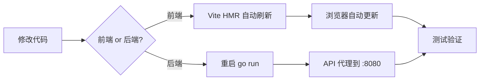

# nowen-video

> 你的私人家庭影音中心 🎬

一个基于 **Go + React** 构建的轻量级家庭媒体服务器，类似 Emby / Jellyfin，专为 NAS 部署优化。  
单二进制 + SQLite，Docker 一键启动，零配置即可使用。

---

## 📑 目录

- [核心特性](#-核心特性)
- [架构概览](#-架构概览)
- [功能页面](#-功能页面)
- [快速开始](#-快速开始)
- [配置说明](#-配置说明)
- [API 接口总览](#-api-接口总览)
- [数据模型](#-数据模型)
- [项目结构](#-项目结构)
- [开发指南](#-开发指南)
- [技术栈](#-技术栈)
- [硬件加速](#-硬件加速)
- [未来发展规划](#-未来发展规划)
- [License](#-license)

---

## ✨ 核心特性

### 🎬 媒体库管理
- 自动扫描目录中的视频文件（MKV / MP4 / AVI / MOV / WebM 等 9 种格式）
- 使用 FFprobe 自动提取视频编码、分辨率、时长等元数据
- 自动发现同目录下的外挂字幕文件（SRT / ASS / SSA / VTT / SUB）
- 支持自动发现海报图片（同名 JPG/PNG/WebP、poster、cover、folder）
- 支持 NFO 文件解析（优先读取本地 NFO 元数据和图片）
- 媒体库级别高级设置：最小文件过滤、元数据语言、成人内容控制
- 实时文件监控（基于 fsnotify），新增/修改/删除文件自动同步
- 启动时自动清理孤立数据，保持数据一致性

### 📺 智能播放
- **直接播放** — MP4 / WebM / M4V 等浏览器兼容格式零延迟直接播放，支持 Range 请求（拖动进度条）
- **HLS 转码播放** — MKV / AVI 等不兼容格式自动按需转码为 HLS 自适应流，支持多码率（360p / 480p / 720p / 1080p）
- **智能模式选择** — 前端自动检测文件格式，优先直接播放，不兼容时走 HLS 转码
- 全功能播放器控制栏：播放/暂停、进度拖动、音量调节、全屏、画质切换
- 键盘快捷键：`空格/K` 播放暂停、`←→` 快进快退、`↑↓` 音量、`F` 全屏、`M` 静音
- 视频书签功能：在任意时间点添加书签和备注，快速跳转

### ⚡ 硬件加速转码
- 自动检测可用硬件加速方式（启动时检测 FFmpeg 编码器能力）
- 支持 **Intel QSV** / **VAAPI** / **NVIDIA NVENC** / 软件编码（libx264 兜底）
- 可配置转码预设和并发任务数，NAS 低功耗设备友好
- 转码缓存机制，相同质量只需转码一次
- 转码任务监控与取消

### 🎨 多数据源元数据刮削
项目采用 **Provider Chain（多数据源调度链）** 架构，按优先级自动调度多个数据源：

| 优先级 | 数据源 | 说明 |
|--------|--------|------|
| 10 | **TMDb** | 主数据源，电影/剧集元数据 |
| 20 | **豆瓣** | 补充源，TMDb 失败或信息不完整时自动回落 |
| 25 | **TheTVDB** | 剧集增强源，获取电视剧集的详细元数据 |
| 30 | **Bangumi** | 动画专项源，番剧/动画元数据 |
| 50 | **Fanart.tv** | 图片增强源，高质量 ClearLogo、背景图、光碟封面 |
| 100 | **AI** | 兜底源，当所有传统数据源失败时用 AI 生成简介和标签 |

- 自动匹配电影/剧集，获取海报、简介、评分、类型标签
- 剧集合集级刮削 — 以合集名称搜索，元数据自动同步到各集
- 支持从文件名智能提取搜索关键词和年份
- 自动清理文件名中的 BluRay / x264 / 1080p 等标记
- API Key 可在管理后台在线配置，无需重启
- **刮削任务管理** — 批量创建/执行/翻译刮削任务，支持进度追踪和历史记录
- **手动元数据匹配** — 管理员可手动搜索并匹配 TMDb / Bangumi 元数据
- **元数据编辑** — 支持在线编辑媒体/剧集的标题、简介、评分等信息
- **图片管理** — 支持上传、URL 设置、TMDb 图片选择三种方式更换海报/背景图

### 📂 剧集合集识别
- 基于文件夹的剧集自动识别（每个子目录 = 一部剧集）
- 支持常见剧集命名格式：`S01E01` / `1x01` / `第01集` / `EP01` / `Episode 01` / `E01`
- 自动提取季号（Season）和集号（Episode）
- 支持 `Season XX` / `S01` / `第1季` / `Specials` 目录结构
- 支持层级目录（剧集名/Season XX/视频文件）和扁平化目录
- 自动创建剧集合集条目，保持播放顺序
- 季视图和全部剧集视图两种浏览模式
- 剧集详情页（Banner + 海报 + 简介 + 季切换 + 集列表）
- 下一集查询接口（用于连续播放）

### 🔤 字幕支持
- 自动扫描外挂字幕文件（SRT / ASS / SSA / VTT / SUB）
- 读取视频内嵌字幕轨道信息（通过 FFprobe）
- 按需提取内嵌字幕为 WebVTT 格式供浏览器使用
- 从文件名自动检测字幕语言（中 / 英 / 日 / 韩等）

### 👨‍👩‍👧‍👦 多用户与权限管理
- 家庭成员独立账号，支持管理员/普通用户角色
- 每用户独立的观看历史、播放进度记录
- 每用户独立的收藏夹
- 自定义播放列表（创建、添加、排序、删除）
- 播放进度自动上报（每 15 秒），换设备续播
- **细粒度权限控制** — 按用户设置可访问的媒体库、内容分级限制、每日观看时长
- **内容分级** — 支持 G / PG / PG-13 / R / NC-17 分级标记
- **评论与评分** — 用户可对媒体发表评论和打分

### 📶 WebSocket 实时通知
- 扫描进度实时推送（新发现文件数、当前处理文件名）
- 元数据刮削进度实时推送（当前/总数、成功/失败计数、进度条）
- 转码进度实时推送（百分比进度 + FFmpeg 转码速度）
- 自动重连机制（断线后 3 秒自动重连，最多 10 次）
- 心跳保活（Ping/Pong，60秒超时断开）
- 活动日志流（管理后台实时展示最近操作记录）

### 🧠 AI 智能功能
集成 LLM（大语言模型），支持 OpenAI / DeepSeek / 通义千问 / Ollama 等 OpenAI 兼容 API：

- **AI 智能搜索** — 自然语言查询转结构化搜索参数（如"找一部关于太空的科幻片"）
- **AI 推荐理由** — 为推荐结果生成个性化推荐文案
- **AI 元数据增强** — 当传统数据源全部失败时，用 AI 生成简介和标签
- **AI 文件重命名** — 智能分析文件名并生成规范化重命名建议
- **AI 助手** — 管理后台内置 AI 对话助手，支持自然语言操作媒体库
  - 分析错误分类的文件
  - 执行批量重分类操作
  - 操作可撤销
- 结果缓存机制，避免重复调用
- 可配置月度预算上限、并发数、请求间隔

### 🧠 智能推荐
- 基于观看历史、收藏、类型偏好的个性化推荐
- 相似媒体推荐
- AI 增强推荐理由（可选）

### 💻 投屏支持
- DLNA/Chromecast 设备发现与控制
- 投屏会话管理（播放/暂停/停止/进度控制）

### 📊 播放统计
- 用户观影时长统计
- 按日期维度的观看数据
- 管理员可查看任意用户的统计数据

### 📁 影视文件管理
- 文件浏览与详情查看
- 批量导入/删除文件
- 文件重命名（模板/预览/AI 生成）
- 文件级别刮削
- 操作日志记录

### 🛡️ 安全认证
- JWT Token 认证，支持 Token 刷新
- 请求头 Bearer Token + URL Query Token 双模式（视频流场景兼容）
- CORS 跨域中间件（支持多源配置、`*` 通配）
- 管理员权限独立守护（中间件级别）
- bcrypt 密码加密存储
- 访问日志记录（登录、播放、管理操作等）
- 安全中间件（请求头安全加固）

### 🖥️ 管理后台
- **仪表板** — CPU / 内存 / 协程数 / Go 版本 / 硬件加速状态 / 实时系统监控
- **媒体库管理** — CRUD + 一键扫描 + 重建索引 + 高级设置
- **WebSocket 实时进度面板** — 扫描/刮削/转码进度条实时更新
- **活动日志流** — 最近操作实时滚动展示
- **转码任务监控** — 状态、进度、速度、取消
- **用户管理** — 列表、删除、权限设置
- **TMDb / Bangumi API Key 在线配置** — 配置 / 修改 / 清除 / 掩码展示
- **系统全局设置** — 在线修改系统参数
- **定时任务管理** — 创建/编辑/删除定时扫描/刮削/清理任务（支持 Cron 表达式）
- **批量操作** — 批量扫描、批量刮削
- **刮削数据管理** — 刮削任务 CRUD、批量执行、翻译、导出、统计
- **影视文件管理** — 文件浏览、导入、重命名、AI 重命名
- **AI 管理** — AI 状态查看、配置修改、连接测试、缓存管理、错误日志
- **AI 助手** — 自然语言对话式媒体库管理
- **数据备份与恢复** — JSON/ZIP 导出、导入恢复
- **文件系统浏览** — 服务器端目录浏览（用于媒体库路径选择）
- WebSocket 连接状态指示器

### 🪶 轻量部署
- 后端单二进制，无外部依赖（除 FFmpeg）
- SQLite 数据库 + WAL 模式（高性能单文件存储，可配置 busy_timeout 和 cache_size）
- Docker 多阶段构建，最小运行镜像（Alpine 3.19）
- 支持环境变量 / 配置文件 / 分片配置 / 命令行多种配置方式
- 前端构建产物内嵌，单端口同时服务 API + 静态文件
- 健康检查内置
- 资源限制友好（Docker 内存限制 512M-2G）

---

## 🏗️ 架构概览

```
┌─────────────────────────────────────────────────────────────────┐
│                        客户端（浏览器）                           │
│  React 18 + TypeScript + Tailwind CSS + Zustand + HLS.js       │
└──────────────────────────────┬──────────────────────────────────┘
                               │ HTTP / WebSocket
                               ▼
┌─────────────────────────────────────────────────────────────────┐
│                     Gin HTTP Server (:8080)                      │
│  ┌──────────┐  ┌──────────┐  ┌──────────┐  ┌──────────────┐    │
│  │ 静态文件  │  │ API 路由  │  │ WebSocket│  │ CORS/JWT/Admin│   │
│  │ (前端)   │  │ (REST)   │  │ (实时)   │  │  中间件       │    │
│  └──────────┘  └────┬─────┘  └────┬─────┘  └──────────────┘    │
└─────────────────────┼─────────────┼─────────────────────────────┘
                      │             │
              ┌───────▼─────────────▼───────┐
              │       Handler 层             │
              │  Auth / Media / Series /     │
              │  Stream / Admin / AI / ...   │
              └───────────┬─────────────────┘
                          │
              ┌───────────▼─────────────────┐
              │       Service 层             │
              │  ┌─────────────────────────┐ │
              │  │  Provider Chain          │ │
              │  │  TMDb → 豆瓣 → TheTVDB  │ │
              │  │  → Bangumi → Fanart → AI│ │
              │  └─────────────────────────┘ │
              │  Scanner / Transcode /       │
              │  Recommend / Scheduler /     │
              │  FileWatcher / Monitor / ... │
              └───────────┬─────────────────┘
                          │
              ┌───────────▼─────────────────┐
              │     Repository 层            │
              │     (GORM 数据访问)          │
              └───────────┬─────────────────┘
                          │
              ┌───────────▼─────────────────┐
│     SQLite (WAL 模式)        │
│     30+ 张表，自动迁移        │
              └─────────────────────────────┘
```

**分层架构说明：**

| 层级 | 职责 | 目录 |
|------|------|------|
| **Handler** | HTTP 请求处理、参数校验、响应格式化 | `internal/handler/` |
| **Service** | 核心业务逻辑、跨模块协调 | `internal/service/` |
| **Repository** | 数据库 CRUD、查询构建 | `internal/repository/` |
| **Model** | GORM 数据模型定义、自动迁移 | `internal/model/` |
| **Config** | 多层配置加载（默认值 → 文件 → 分片 → 环境变量） | `internal/config/` |
| **Middleware** | JWT 认证、CORS、管理员权限、安全头 | `internal/middleware/` |

---

## 📸 功能页面


| 页面 | 路由 | 说明 |
|------|------|------|
| 首页 | `/` | 继续观看 + 最近添加 + 智能推荐 |
| 媒体库 | `/library/:id` | 按媒体库浏览内容（支持剧集合集视图） |
| 剧集详情 | `/series/:id` | 剧集合集页，季视图/全部视图切换 |
| 媒体详情 | `/media/:id` | 海报、简介、评分、编码信息、播放按钮、评论 |
| 播放器 | `/play/:id` | 全屏沉浸式播放，支持直接播放/HLS双模式 |
| 搜索 | `/search` | 关键词搜索 + AI 智能搜索 |
| 收藏夹 | `/favorites` | 收藏的媒体列表 |
| 观看历史 | `/history` | 观看记录，支持清除 |
| 播放列表 | `/playlists` | 自定义播放列表管理 |
| 播放统计 | `/stats` | 个人观影统计数据 |
| 个人资料 | `/profile` | 用户信息管理 |
| 管理后台 | `/admin` | 系统状态、媒体库管理、用户管理、配置管理 |
| 文件管理 | `/files` | 影视文件浏览、导入、重命名（含刮削任务 Tab） |
| 文件管理 - 刮削任务 | `/files?tab=scrape` | 刮削任务管理、批量操作、翻译（已整合至文件管理） |
| 家庭空间 | `/family` | 家庭群组、媒体分享、互动推荐 |
| 直播 | `/live` | IPTV 直播源管理与播放 |
| 云同步 | `/sync` | 多设备数据同步与配置管理 |
| 登录 | `/login` | 用户认证 |

---

## 🚀 快速开始

### Docker 部署（推荐）

```bash
# 1. 克隆项目
git clone https://github.com/your-repo/nowen-video.git
cd nowen-video

# 2. 修改 docker-compose.yml 中的媒体目录挂载路径
#    将 /volume1/video 改为你的实际媒体目录

# 3. 修改 JWT Secret（重要！）
#    编辑 docker-compose.yml 中的 NOWEN_SECRETS_JWT_SECRET

# 4. 启动
docker-compose up -d

# 5. 访问 http://你的NAS地址:8080
#    默认管理员: admin / admin123
```

### 本地开发

```bash
# 前置要求: Go 1.22+, Node.js 20+, FFmpeg

# 1. 安装依赖
go mod tidy
cd web && npm install && cd ..

# 2. 启动后端（开发模式）
make dev
# 或: NOWEN_DEBUG=true go run ./cmd/server

# 3. 启动前端（另一个终端）
make dev-web
# 或: cd web && npm run dev

# 4. 访问 http://localhost:3000 （Vite 自动代理 API 到 :8080）
#    默认管理员: admin / admin123
```

### 生产构建

```bash
# 一键构建（前端 + 后端）
make build

# 或分步构建：
# 构建前端
cd web && npm run build && cd ..
# 构建后端（内嵌前端静态文件）
CGO_ENABLED=1 go build -o bin/nowen-video ./cmd/server

# 运行
./bin/nowen-video
# 访问 http://localhost:8080
```

### Docker 构建

```bash
# 构建并启动
make docker

# 停止
make docker-stop
```

---

## ⚙️ 配置说明

### 配置加载优先级

配置按以下优先级加载（从低到高），高优先级覆盖低优先级：

1. **内置默认值** — 零配置可运行
2. **主配置文件** `config.yaml` — 支持旧版扁平格式和新版嵌套格式
3. **分片配置文件** `config/` 目录 — 按模块分类管理
4. **环境变量** — `NOWEN_` 前缀，如 `NOWEN_APP_PORT=8080`

### 分片配置文件

推荐使用 `config/` 目录下的分片配置文件，便于分类管理和安全隔离：

| 文件 | 说明 |
|------|------|
| `config/database.yaml` | 数据库连接参数 |
| `config/secrets.yaml` | JWT 密钥、第三方 API 密钥（⚠️ 勿提交到 Git） |
| `config/app.yaml` | 应用运行环境配置 |
| `config/logging.yaml` | 日志记录设置 |
| `config/cache.yaml` | 缓存配置参数 |
| `config/ai.yaml` | AI 功能配置 |

### 应用配置 (`app`)

| 配置项 | 环境变量 | 默认值 | 说明 |
|--------|----------|--------|------|
| `app.port` | `NOWEN_APP_PORT` | `8080` | 服务端口 |
| `app.debug` | `NOWEN_APP_DEBUG` | `false` | 调试模式 |
| `app.env` | `NOWEN_APP_ENV` | `production` | 运行环境 |
| `app.data_dir` | `NOWEN_APP_DATA_DIR` | `./data` | 数据目录 |
| `app.web_dir` | `NOWEN_APP_WEB_DIR` | `./web/dist` | 前端静态文件目录 |
| `app.ffmpeg_path` | `NOWEN_APP_FFMPEG_PATH` | `ffmpeg` | FFmpeg 路径 |
| `app.ffprobe_path` | `NOWEN_APP_FFPROBE_PATH` | `ffprobe` | FFprobe 路径 |
| `app.hw_accel` | `NOWEN_APP_HW_ACCEL` | `auto` | 硬件加速模式 |
| `app.vaapi_device` | `NOWEN_APP_VAAPI_DEVICE` | `/dev/dri/renderD128` | VAAPI 设备路径 |
| `app.transcode_preset` | `NOWEN_APP_TRANSCODE_PRESET` | `veryfast` | 转码预设 |
| `app.max_transcode_jobs` | `NOWEN_APP_MAX_TRANSCODE_JOBS` | `2` | 最大并发转码数 |
| `app.cors_origins` | `NOWEN_APP_CORS_ORIGINS` | `[]` | CORS 允许源列表 |

### 数据库配置 (`database`)

| 配置项 | 环境变量 | 默认值 | 说明 |
|--------|----------|--------|------|
| `database.db_path` | `NOWEN_DATABASE_DB_PATH` | `./data/nowen.db` | SQLite 数据库路径 |
| `database.wal_mode` | `NOWEN_DATABASE_WAL_MODE` | `true` | WAL 模式 |
| `database.busy_timeout` | `NOWEN_DATABASE_BUSY_TIMEOUT` | `5000` | 繁忙超时（ms） |
| `database.cache_size` | `NOWEN_DATABASE_CACHE_SIZE` | `-20000` | 缓存大小（负数为 KB） |
| `database.max_open_conns` | `NOWEN_DATABASE_MAX_OPEN_CONNS` | `1` | 最大打开连接数 |
| `database.max_idle_conns` | `NOWEN_DATABASE_MAX_IDLE_CONNS` | `1` | 最大空闲连接数 |

### 密钥配置 (`secrets`)

| 配置项 | 环境变量 | 默认值 | 说明 |
|--------|----------|--------|------|
| `secrets.jwt_secret` | `NOWEN_SECRETS_JWT_SECRET` | *(需修改)* | JWT 签名密钥 |
| `secrets.tmdb_api_key` | `NOWEN_SECRETS_TMDB_API_KEY` | *(空)* | TMDb API Key |
| `secrets.tmdb_api_proxy` | `NOWEN_SECRETS_TMDB_API_PROXY` | *(空)* | TMDb API 代理地址 |
| `secrets.tmdb_image_proxy` | `NOWEN_SECRETS_TMDB_IMAGE_PROXY` | *(空)* | TMDb 图片代理地址 |
| `secrets.bangumi_access_token` | `NOWEN_SECRETS_BANGUMI_ACCESS_TOKEN` | *(空)* | Bangumi Access Token |
| `secrets.thetvdb_api_key` | `NOWEN_SECRETS_THETVDB_API_KEY` | *(空)* | TheTVDB API Key |
| `secrets.fanart_tv_api_key` | `NOWEN_SECRETS_FANART_TV_API_KEY` | *(空)* | Fanart.tv API Key |

### 日志配置 (`logging`)

| 配置项 | 环境变量 | 默认值 | 说明 |
|--------|----------|--------|------|
| `logging.level` | `NOWEN_LOGGING_LEVEL` | `info` | 日志级别 |
| `logging.format` | `NOWEN_LOGGING_FORMAT` | `console` | 输出格式 (json/console) |
| `logging.output_path` | `NOWEN_LOGGING_OUTPUT_PATH` | *(stdout)* | 日志输出路径 |
| `logging.enable_rotation` | `NOWEN_LOGGING_ENABLE_ROTATION` | `false` | 启用日志轮转 |
| `logging.max_size_mb` | `NOWEN_LOGGING_MAX_SIZE_MB` | `100` | 单文件最大 MB |
| `logging.max_age_days` | `NOWEN_LOGGING_MAX_AGE_DAYS` | `30` | 最大保留天数 |
| `logging.max_backups` | `NOWEN_LOGGING_MAX_BACKUPS` | `10` | 最大保留个数 |

### 缓存配置 (`cache`)

| 配置项 | 环境变量 | 默认值 | 说明 |
|--------|----------|--------|------|
| `cache.cache_dir` | `NOWEN_CACHE_CACHE_DIR` | `./cache` | 缓存目录 |
| `cache.max_disk_usage_mb` | `NOWEN_CACHE_MAX_DISK_USAGE_MB` | `0` | 最大磁盘占用（0=不限） |
| `cache.ttl_hours` | `NOWEN_CACHE_TTL_HOURS` | `0` | 缓存过期时间（0=不过期） |
| `cache.auto_cleanup` | `NOWEN_CACHE_AUTO_CLEANUP` | `false` | 自动清理 |
| `cache.cleanup_interval_min` | `NOWEN_CACHE_CLEANUP_INTERVAL_MIN` | `60` | 清理间隔（分钟） |

### AI 配置 (`ai`)

| 配置项 | 环境变量 | 默认值 | 说明 |
|--------|----------|--------|------|
| `ai.enabled` | `NOWEN_AI_ENABLED` | `false` | AI 总开关 |
| `ai.provider` | `NOWEN_AI_PROVIDER` | `openai` | LLM 提供商 |
| `ai.api_base` | `NOWEN_AI_API_BASE` | `https://api.openai.com/v1` | API 地址 |
| `ai.api_key` | `NOWEN_AI_API_KEY` | *(空)* | API 密钥 |
| `ai.model` | `NOWEN_AI_MODEL` | `gpt-4o-mini` | 模型名称 |
| `ai.timeout` | `NOWEN_AI_TIMEOUT` | `30` | 请求超时（秒） |
| `ai.enable_smart_search` | `NOWEN_AI_ENABLE_SMART_SEARCH` | `true` | 智能搜索 |
| `ai.enable_recommend_reason` | `NOWEN_AI_ENABLE_RECOMMEND_REASON` | `true` | 推荐理由 |
| `ai.enable_metadata_enhance` | `NOWEN_AI_ENABLE_METADATA_ENHANCE` | `true` | 元数据增强 |
| `ai.monthly_budget` | `NOWEN_AI_MONTHLY_BUDGET` | `0` | 月度预算（0=不限） |
| `ai.cache_ttl_hours` | `NOWEN_AI_CACHE_TTL_HOURS` | `168` | 缓存时间（小时） |
| `ai.max_concurrent` | `NOWEN_AI_MAX_CONCURRENT` | `3` | 最大并发数 |

### AI 提供商配置示例

```yaml
# OpenAI
ai:
  provider: "openai"
  api_base: "https://api.openai.com/v1"
  model: "gpt-4o-mini"

# DeepSeek
ai:
  provider: "deepseek"
  api_base: "https://api.deepseek.com/v1"
  model: "deepseek-chat"

# 通义千问
ai:
  provider: "qwen"
  api_base: "https://dashscope.aliyuncs.com/compatible-mode/v1"
  model: "qwen-turbo"

# Ollama（本地部署）
ai:
  provider: "ollama"
  api_base: "http://localhost:11434/v1"
  model: "llama3"
```

### 旧版扁平格式兼容

系统完全向后兼容旧版扁平配置格式，以下 key 仍然有效：

```yaml
port: 8080
debug: false
data_dir: ./data
cache_dir: ./cache
db_path: ./data/nowen.db
jwt_secret: your-secret
tmdb_api_key: ""
ffmpeg_path: ffmpeg
ffprobe_path: ffprobe
hw_accel: auto
```

---

## 🔌 API 接口总览

### 公开接口

| 方法 | 路径 | 说明 |
|------|------|------|
| POST | `/api/auth/login` | 用户登录 |
| POST | `/api/auth/register` | 用户注册 |

### 认证接口（需要 JWT Token）

#### 认证管理

| 方法 | 路径 | 说明 |
|------|------|------|
| POST | `/api/auth/refresh` | 刷新 Token |

#### 媒体库

| 方法 | 路径 | 说明 |
|------|------|------|
| GET | `/api/libraries` | 获取媒体库列表 |
| POST | `/api/libraries` | 创建媒体库 🔒 |
| PUT | `/api/libraries/:id` | 更新媒体库 🔒 |
| POST | `/api/libraries/:id/scan` | 扫描媒体库 🔒 |
| POST | `/api/libraries/:id/reindex` | 重建索引 🔒 |
| DELETE | `/api/libraries/:id` | 删除媒体库 🔒 |

#### 媒体内容

| 方法 | 路径 | 说明 |
|------|------|------|
| GET | `/api/media` | 媒体列表（分页） |
| GET | `/api/media/:id` | 媒体详情 |
| GET | `/api/media/recent` | 最近添加 |
| GET | `/api/media/recent/aggregated` | 最近添加（聚合剧集） |
| GET | `/api/media/recent/mixed` | 最近添加（混合视图） |
| GET | `/api/media/aggregated` | 媒体列表（聚合剧集） |
| GET | `/api/media/mixed` | 媒体列表（混合视图） |
| GET | `/api/media/continue` | 继续观看 |
| GET | `/api/media/:id/poster` | 获取海报图片 |
| GET | `/api/media/:id/persons` | 获取演职人员 |

#### 剧集合集

| 方法 | 路径 | 说明 |
|------|------|------|
| GET | `/api/series` | 剧集合集列表（分页） |
| GET | `/api/series/:id` | 剧集合集详情（含所有剧集） |
| GET | `/api/series/:id/seasons` | 季列表（季视图） |
| GET | `/api/series/:id/seasons/:season` | 指定季的剧集列表 |
| GET | `/api/series/:id/next` | 下一集（连续播放） |
| GET | `/api/series/:id/poster` | 剧集海报 |
| GET | `/api/series/:id/backdrop` | 剧集背景图 |

#### 流媒体

| 方法 | 路径 | 说明 |
|------|------|------|
| GET | `/api/stream/:id/info` | 获取播放信息 |
| GET | `/api/stream/:id/direct` | 直接播放视频文件 |
| GET | `/api/stream/:id/master.m3u8` | HLS 主播放列表 |
| GET | `/api/stream/:id/:quality/:segment` | HLS 分片 |

#### 字幕

| 方法 | 路径 | 说明 |
|------|------|------|
| GET | `/api/subtitle/:id/tracks` | 字幕轨道列表 |
| GET | `/api/subtitle/:id/extract/:index` | 提取内嵌字幕 |
| GET | `/api/subtitle/external` | 获取外挂字幕文件 |

#### 搜索

| 方法 | 路径 | 说明 |
|------|------|------|
| GET | `/api/search` | 关键词搜索 |
| GET | `/api/search/advanced` | 高级搜索 |
| GET | `/api/search/mixed` | 混合搜索（电影+剧集） |
| GET | `/api/ai/search` | AI 智能搜索 |

#### 推荐

| 方法 | 路径 | 说明 |
|------|------|------|
| GET | `/api/recommend` | 个性化推荐 |
| GET | `/api/recommend/similar/:mediaId` | 相似媒体推荐 |

#### 用户

| 方法 | 路径 | 说明 |
|------|------|------|
| GET | `/api/users/me` | 当前用户信息 |
| PUT | `/api/users/me/progress/:mediaId` | 更新播放进度 |
| GET | `/api/users/me/progress/:mediaId` | 获取播放进度 |
| GET/POST/DELETE | `/api/users/me/favorites` | 收藏管理 |
| GET | `/api/users/me/favorites/:mediaId/check` | 检查是否已收藏 |
| GET/DELETE | `/api/users/me/history` | 观看历史 |

#### 播放列表

| 方法 | 路径 | 说明 |
|------|------|------|
| GET/POST | `/api/playlists` | 播放列表列表/创建 |
| GET/DELETE | `/api/playlists/:id` | 播放列表详情/删除 |
| POST/DELETE | `/api/playlists/:id/items/:mediaId` | 添加/移除项目 |

#### 投屏

| 方法 | 路径 | 说明 |
|------|------|------|
| GET | `/api/cast/devices` | 设备列表 |
| POST | `/api/cast/devices/refresh` | 刷新设备 |
| POST | `/api/cast/start` | 开始投屏 |
| GET | `/api/cast/sessions` | 会话列表 |
| POST | `/api/cast/sessions/:sessionId/control` | 控制投屏 |
| DELETE | `/api/cast/sessions/:sessionId` | 停止投屏 |

#### 书签

| 方法 | 路径 | 说明 |
|------|------|------|
| POST | `/api/bookmarks` | 创建书签 |
| GET | `/api/bookmarks` | 用户书签列表 |
| GET | `/api/bookmarks/media/:mediaId` | 媒体书签列表 |
| PUT/DELETE | `/api/bookmarks/:id` | 更新/删除书签 |

#### 评论

| 方法 | 路径 | 说明 |
|------|------|------|
| GET | `/api/media/:id/comments` | 评论列表 |
| POST | `/api/media/:id/comments` | 发表评论 |
| DELETE | `/api/comments/:id` | 删除评论 |

#### 统计

| 方法 | 路径 | 说明 |
|------|------|------|
| POST | `/api/stats/playback` | 记录播放统计 |
| GET | `/api/stats/me` | 个人统计 |

#### WebSocket

| 方法 | 路径 | 说明 |
|------|------|------|
| GET | `/api/ws` | WebSocket 实时通知 |

### 管理接口 🔒（需要管理员权限）

#### 用户与系统

| 方法 | 路径 | 说明 |
|------|------|------|
| GET | `/api/admin/users` | 用户列表 |
| DELETE | `/api/admin/users/:id` | 删除用户 |
| GET | `/api/admin/system` | 系统信息 |
| GET | `/api/admin/metrics` | 系统监控指标 |

#### 转码管理

| 方法 | 路径 | 说明 |
|------|------|------|
| GET | `/api/admin/transcode/status` | 转码任务状态 |
| POST | `/api/admin/transcode/:taskId/cancel` | 取消转码任务 |

#### 配置管理

| 方法 | 路径 | 说明 |
|------|------|------|
| GET/PUT/DELETE | `/api/admin/settings/tmdb` | TMDb API Key 配置 |
| GET/PUT/DELETE | `/api/admin/settings/bangumi` | Bangumi 配置 |
| GET/PUT | `/api/admin/settings/system` | 系统全局设置 |

#### 定时任务

| 方法 | 路径 | 说明 |
|------|------|------|
| GET/POST | `/api/admin/tasks` | 任务列表/创建 |
| PUT/DELETE | `/api/admin/tasks/:id` | 更新/删除任务 |
| POST | `/api/admin/tasks/:id/run` | 立即执行任务 |

#### 批量操作

| 方法 | 路径 | 说明 |
|------|------|------|
| POST | `/api/admin/batch/scan` | 批量扫描 |
| POST | `/api/admin/batch/scrape` | 批量刮削 |

#### 权限与分级

| 方法 | 路径 | 说明 |
|------|------|------|
| GET/PUT | `/api/admin/permissions/:userId` | 用户权限管理 |
| GET/PUT | `/api/admin/rating/:mediaId` | 内容分级管理 |

#### 元数据管理

| 方法 | 路径 | 说明 |
|------|------|------|
| GET | `/api/admin/metadata/search` | 搜索元数据 |
| POST | `/api/admin/media/:mediaId/match` | 匹配元数据 |
| POST | `/api/admin/media/:mediaId/unmatch` | 取消匹配 |
| PUT | `/api/admin/media/:mediaId/metadata` | 编辑元数据 |
| DELETE | `/api/admin/media/:mediaId` | 删除媒体 |
| POST | `/api/admin/series/:seriesId/match` | 匹配剧集元数据 |
| POST | `/api/admin/series/:seriesId/scrape` | 刮削剧集元数据 |
| PUT | `/api/admin/series/:seriesId/metadata` | 编辑剧集元数据 |
| DELETE | `/api/admin/series/:seriesId` | 删除剧集 |

#### Bangumi 数据源

| 方法 | 路径 | 说明 |
|------|------|------|
| GET | `/api/admin/metadata/bangumi/search` | 搜索 Bangumi |
| GET | `/api/admin/metadata/bangumi/subject/:subjectId` | 获取条目详情 |
| POST | `/api/admin/media/:mediaId/match/bangumi` | 匹配 Bangumi |
| POST | `/api/admin/series/:seriesId/match/bangumi` | 剧集匹配 Bangumi |

#### 图片管理

| 方法 | 路径 | 说明 |
|------|------|------|
| GET | `/api/admin/images/tmdb` | 搜索 TMDb 图片 |
| POST | `/api/admin/media/:mediaId/image/upload` | 上传媒体图片 |
| POST | `/api/admin/media/:mediaId/image/url` | URL 设置图片 |
| POST | `/api/admin/media/:mediaId/image/tmdb` | TMDb 图片设置 |
| POST | `/api/admin/series/:seriesId/image/*` | 剧集图片管理 |

#### 数据备份

| 方法 | 路径 | 说明 |
|------|------|------|
| POST | `/api/admin/backup/json` | 导出 JSON |
| POST | `/api/admin/backup/zip` | 导出 ZIP |
| POST | `/api/admin/backup/import` | 导入备份 |
| GET | `/api/admin/backup/list` | 备份列表 |

#### AI 管理

| 方法 | 路径 | 说明 |
|------|------|------|
| GET | `/api/admin/ai/status` | AI 状态 |
| PUT | `/api/admin/ai/config` | 更新 AI 配置 |
| POST | `/api/admin/ai/test` | 测试 AI 连接 |
| GET/DELETE | `/api/admin/ai/cache` | AI 缓存管理 |
| GET | `/api/admin/ai/errors` | AI 错误日志 |
| POST | `/api/admin/ai/test/search` | 测试智能搜索 |
| POST | `/api/admin/ai/test/recommend` | 测试推荐理由 |

#### 刮削数据管理

| 方法 | 路径 | 说明 |
|------|------|------|
| GET/POST | `/api/admin/scrape/tasks` | 刮削任务列表/创建 |
| POST | `/api/admin/scrape/tasks/batch` | 批量创建任务 |
| GET/PUT/DELETE | `/api/admin/scrape/tasks/:id` | 任务详情/更新/删除 |
| POST | `/api/admin/scrape/tasks/:id/scrape` | 执行刮削 |
| POST | `/api/admin/scrape/tasks/:id/translate` | 翻译任务 |
| POST | `/api/admin/scrape/batch/*` | 批量刮削/翻译/删除 |
| POST | `/api/admin/scrape/export` | 导出任务 |
| GET | `/api/admin/scrape/statistics` | 刮削统计 |
| GET | `/api/admin/scrape/history` | 刮削历史 |

#### 影视文件管理

| 方法 | 路径 | 说明 |
|------|------|------|
| GET | `/api/admin/files` | 文件列表 |
| GET | `/api/admin/files/:id` | 文件详情 |
| POST | `/api/admin/files/import` | 导入文件 |
| POST | `/api/admin/files/import/batch` | 批量导入 |
| GET | `/api/admin/files/scan` | 扫描目录 |
| PUT/DELETE | `/api/admin/files/:id` | 更新/删除文件 |
| POST | `/api/admin/files/rename/*` | 重命名（预览/执行/AI） |
| GET | `/api/admin/files/rename/templates` | 重命名模板 |
| GET | `/api/admin/files/stats` | 文件统计 |
| GET | `/api/admin/files/logs` | 操作日志 |

#### AI 助手

| 方法 | 路径 | 说明 |
|------|------|------|
| POST | `/api/admin/assistant/chat` | AI 对话 |
| POST | `/api/admin/assistant/execute` | 执行 AI 操作 |
| POST | `/api/admin/assistant/undo/:opId` | 撤销操作 |
| GET | `/api/admin/assistant/session/:sessionId` | 获取会话 |
| DELETE | `/api/admin/assistant/session/:sessionId` | 删除会话 |
| GET | `/api/admin/assistant/history` | 操作历史 |
| GET | `/api/admin/assistant/misclassification` | 分析错误分类 |
| POST | `/api/admin/assistant/reclassify` | 重新分类 |

#### 其他

| 方法 | 路径 | 说明 |
|------|------|------|
| GET | `/api/admin/logs` | 访问日志 |
| GET | `/api/admin/fs/browse` | 文件系统浏览 |
| GET | `/api/admin/stats/:userId` | 用户统计（管理员） |

> 🔒 = 需要管理员权限

---

## 🗄️ 数据模型

系统共包含 **21 张数据表**，使用 GORM 自动迁移：

```
┌─────────────┐     ┌─────────────┐     ┌───────────────┐
│   User      │     │   Library   │     │    Series     │
├─────────────┤     ├─────────────┤     ├───────────────┤
│ id          │     │ id          │◄────│ library_id    │
│ username    │     │ name        │     │ title         │
│ password    │     │ path        │     │ orig_title    │
│ role        │     │ type        │     │ folder_path   │
│ avatar      │     │ last_scan   │     │ poster_path   │
│             │     │ prefer_nfo  │     │ backdrop_path │
│             │     │ min_file_sz │     │ overview      │
│             │     │ metadata_   │     │ rating        │
│             │     │   lang      │     │ genres        │
│             │     │ enable_file │     │ tmdb_id       │
│             │     │   _watch    │     │ douban_id     │
│             │     │             │     │ bangumi_id    │
│             │     │             │     │ season_count  │
│             │     │             │     │ episode_count │
└──────┬──────┘     └─────────────┘     └───────┬───────┘
       │                                        │
       │                                ┌───────┴───────┐
       │                                │    Media      │
       │                                ├───────────────┤
       │                                │ library_id    │
       │                                │ series_id     │ ◄ 剧集关联
       │                                │ title         │
       │                                │ orig_title    │
       │                                │ file_path     │
       │                                │ media_type    │ ◄ movie/episode
       │                                │ season_num    │
       │                                │ episode_num   │
       │                                │ episode_title │
       │                                │ video_codec   │
       │                                │ audio_codec   │
       │                                │ resolution    │
       │                                │ duration      │
       │                                │ file_size     │
       │                                │ poster_path   │
       │                                │ backdrop_path │
       │                                │ overview      │
       │                                │ rating        │
       │                                │ tmdb_id       │
       │                                │ douban_id     │
       │                                │ bangumi_id    │
       │                                │ trailer_url   │
       │                                │ subtitle_paths│
       │                                └───────┬───────┘
       │                                        │
       │  ┌──────────────────┐                   │
       ├──│  WatchHistory    │───────────────────┘
       │  │ position/duration│
       │  │ completed        │
       │  └──────────────────┘
       │
       │  ┌──────────────────┐     ┌────────────────┐
       ├──│  Favorite        │     │ PlaylistItem   │
       │  │ media_id         │     │ media_id       │
       │  └──────────────────┘     │ sort_order     │
       │                           └────────┬───────┘
       │  ┌──────────────────┐              │
       ├──│  Playlist        │──────────────┘
       │  │ name             │
       │  └──────────────────┘
       │
       │  ┌──────────────────┐     ┌────────────────┐
       ├──│  Bookmark        │     │ Comment        │
       │  │ media_id         │     │ media_id       │
       │  │ position/title   │     │ content/rating │
       │  └──────────────────┘     └────────────────┘
       │
       │  ┌──────────────────┐
       ├──│  PlaybackStats   │
       │  │ media_id/date    │
       │  │ watch_minutes    │
       │  └──────────────────┘
       │
       │  ┌──────────────────┐
       └──│  UserPermission  │
          │ allowed_libraries│
          │ max_rating_level │
          │ daily_time_limit │
          └──────────────────┘

┌──────────────────┐     ┌────────────────┐
│ Person           │     │ MediaPerson    │
│ name/orig_name   │◄────│ media_id       │
│ profile_url      │     │ series_id      │
│ tmdb_id          │     │ role/character │
└──────────────────┘     └────────────────┘

┌──────────────────┐     ┌────────────────┐
│ TranscodeTask    │     │ ContentRating  │
│ media_id/quality │     │ media_id       │
│ status/progress  │     │ level (G~NC17) │
└──────────────────┘     └────────────────┘

┌──────────────────┐     ┌────────────────┐
│ ScheduledTask    │     │ AccessLog      │
│ type/schedule    │     │ user_id/action │
│ target_id        │     │ resource/ip    │
│ enabled/status   │     └────────────────┘
└──────────────────┘

┌──────────────────┐     ┌────────────────┐
│ ScrapeTask       │     │ ScrapeHistory  │
│ url/source       │     │ task_id/action │
│ status/progress  │     │ detail         │
│ result_*         │     └────────────────┘
│ translated_*     │
└──────────────────┘

┌──────────────────┐
│ SystemSetting    │
│ key/value (KV)   │
└──────────────────┘
```

---

## 📁 项目结构

```
nowen-video/
├── cmd/server/main.go            # Go 入口（路由注册、依赖注入、562行）
├── internal/
│   ├── config/
│   │   └── config.go             # 多层配置加载（默认值→文件→分片→环境变量）
│   ├── handler/                  # HTTP 处理器层（28个文件）
│   │   ├── handler.go            #   Handler 聚合与初始化
│   │   ├── auth.go               #   登录 / 注册
│   │   ├── media.go              #   媒体列表 / 详情 / 搜索 / 聚合视图
│   │   ├── series.go             #   剧集合集列表 / 详情 / 季视图 / 下一集
│   │   ├── library.go            #   媒体库 CRUD + 扫描 + 重建索引
│   │   ├── stream.go             #   直接播放 / HLS流 / 海报
│   │   ├── subtitle.go           #   字幕轨道 / 提取 / 外挂
│   │   ├── metadata.go           #   元数据刮削
│   │   ├── admin.go              #   系统管理入口
│   │   ├── admin_media.go        #   管理员媒体操作（元数据匹配/编辑/图片管理）
│   │   ├── admin_metadata.go     #   管理员元数据搜索（TMDb/Bangumi）
│   │   ├── admin_system.go       #   系统设置/监控/任务/权限管理
│   │   ├── ai.go                 #   AI 智能搜索 / 配置管理
│   │   ├── ai_assistant.go       #   AI 助手对话 / 操作执行
│   │   ├── ai_scene.go           #   AI 场景识别 / 章节 / 精彩片段
│   │   ├── recommend.go          #   智能推荐
│   │   ├── cast.go               #   投屏控制
│   │   ├── bookmark.go           #   视频书签
│   │   ├── comment.go            #   评论评分
│   │   ├── stats.go              #   播放统计
│   │   ├── playlist.go           #   播放列表
│   │   ├── user.go               #   用户信息 / 进度 / 收藏 / 历史
│   │   ├── scrape_manager.go     #   刮削任务管理
│   │   ├── file_manager.go       #   影视文件管理
│   │   ├── notification.go       #   智能通知系统
│   │   ├── cloud_sync.go         #   云端同步
│   │   ├── family_social.go      #   家庭社交互动
│   │   ├── live.go               #   实时直播
│   │   ├── v2_handlers.go        #   V2 扩展处理器（音乐/图片/联邦/插件等）
│   │   └── ws.go                 #   WebSocket 入口
│   ├── middleware/
│   │   ├── middleware.go          #   JWT认证 / CORS / 管理员权限
│   │   └── security.go           #   安全头中间件
│   ├── model/                    # GORM 数据模型（30+张表，自动迁移）
│   │   ├── model.go              #   核心模型定义（User/Library/Media/Series等）
│   │   ├── scrape_task.go        #   刮削任务模型
│   │   └── v3_models.go          #   V3 扩展模型（AI场景/家庭社交/直播/云同步）
│   ├── repository/
│   │   ├── repository.go         #   数据访问层聚合
│   │   ├── repo_admin.go         #   管理员数据访问
│   │   ├── repo_media.go         #   媒体数据访问
│   │   ├── repo_series.go        #   剧集数据访问
│   │   ├── repo_person.go        #   演职人员数据访问
│   │   ├── repo_social.go        #   社交互动数据访问
│   │   ├── repo_stats.go         #   统计数据访问
│   │   ├── repo_user.go          #   用户数据访问
│   │   ├── repo_library.go       #   媒体库数据访问
│   │   ├── scrape_task.go        #   刮削任务数据访问
│   │   └── v3_repository.go      #   V3 扩展数据访问
│   └── service/                  # 业务逻辑层（30+个文件）
│       ├── service.go            #   服务聚合与依赖注入
│       ├── auth.go               #   JWT 认证服务
│       ├── media.go              #   媒体查询服务
│       ├── series.go             #   剧集合集服务
│       ├── scanner.go            #   文件扫描 + FFprobe + 剧集识别（61KB）
│       ├── stream.go             #   流媒体服务（直接播放 + HLS + 海报）
│       ├── transcode.go          #   FFmpeg 转码（硬件加速 + 工作池 + 进度）
│       ├── metadata.go           #   TMDb 元数据集成（45KB）
│       ├── metadata_provider.go  #   Provider Chain 多数据源调度
│       ├── douban.go             #   豆瓣元数据刮削
│       ├── bangumi.go            #   Bangumi 动画元数据
│       ├── thetvdb.go            #   TheTVDB 剧集元数据
│       ├── fanart.go             #   Fanart.tv 图片增强
│       ├── nfo.go                #   NFO 文件解析
│       ├── ai.go                 #   AI 服务（智能搜索/推荐/增强）
│       ├── ai_assistant.go       #   AI 助手服务（34KB）
│       ├── ai_metadata.go        #   AI 元数据增强
│       ├── ai_recommend.go       #   AI 推荐理由
│       ├── ai_search.go          #   AI 智能搜索
│       ├── recommend.go          #   推荐算法服务
│       ├── cast.go               #   投屏服务（DLNA/Chromecast）
│       ├── library.go            #   媒体库管理
│       ├── playlist.go           #   播放列表服务
│       ├── bookmark.go           #   书签服务
│       ├── comment.go            #   评论服务
│       ├── permission.go         #   权限管理服务
│       ├── scheduler.go          #   定时任务调度（Cron）
│       ├── monitor.go            #   系统监控服务
│       ├── file_watcher.go       #   文件监听服务（fsnotify）
│       ├── file_manager.go       #   文件管理服务（42KB）
│       ├── scrape_manager.go     #   刮削管理服务
│       ├── backup.go             #   数据备份与恢复
│       ├── webhook.go            #   Webhook 通知
│       ├── vfs.go                #   虚拟文件系统
│       ├── stats.go              #   播放统计
│       ├── thumbnail.go          #   缩略图生成
│       ├── errors.go             #   错误定义
│       ├── user.go               #   用户服务
│       ├── user_profile.go       #   多用户配置文件服务
│       ├── ws_hub.go             #   WebSocket Hub（连接管理 + 广播 + 心跳）
│       ├── offline_download.go   #   离线下载服务
│       ├── abr.go                #   自适应码率转码服务
│       ├── plugin.go             #   插件系统服务
│       ├── music.go              #   音乐库服务
│       ├── photo.go              #   图片库服务
│       ├── federation.go         #   多服务器联邦服务
│       ├── ai_scene.go           #   AI 场景识别服务
│       ├── family_social.go      #   家庭社交互动服务
│       ├── live.go               #   实时直播服务
│       ├── cloud_sync.go         #   云端同步服务
│       ├── subtitle_search.go    #   字幕在线搜索服务
│       ├── batch_metadata.go     #   批量元数据编辑服务
│       ├── notification.go       #   智能通知服务
│       ├── auth_test.go          #   认证服务测试
│       ├── scanner_test.go       #   扫描器测试
│       └── permission_test.go    #   权限服务测试
├── web/                          # React 前端
│   ├── src/
│   │   ├── App.tsx               #   路由配置（18个页面路由）
│   │   ├── api/
│   │   │   ├── client.ts         #   Axios 客户端配置
│   │   │   └── index.ts          #   API 封装（26KB）
│   │   ├── components/           #   通用组件
│   │   │   ├── Layout.tsx        #     布局框架
│   │   │   ├── Sidebar.tsx       #     侧边栏导航
│   │   │   ├── VideoPlayer.tsx   #     视频播放器（35KB）
│   │   │   ├── MediaCard.tsx     #     媒体卡片
│   │   │   ├── MediaGrid.tsx     #     媒体网格
│   │   │   ├── Pagination.tsx    #     分页组件
│   │   │   ├── AIAssistant.tsx   #     AI 助手面板
│   │   │   ├── BookmarkPanel.tsx #     书签面板
│   │   │   ├── CastPanel.tsx     #     投屏面板
│   │   │   ├── CommentSection.tsx#     评论区
│   │   │   ├── Toast.tsx         #     消息提示
│   │   │   ├── PageTransition.tsx#     页面过渡动画
│   │   │   ├── SystemMonitor.tsx #     系统监控组件
│   │   │   ├── CreateLibraryModal.tsx  # 创建媒体库弹窗
│   │   │   ├── EditMetadataModal.tsx   # 编辑元数据弹窗
│   │   │   ├── FileBrowser.tsx   #     文件浏览器
│   │   │   ├── LibraryManager.tsx#     媒体库管理器
│   │   │   ├── BatchMetadataEditor.tsx # 批量元数据编辑
│   │   │   ├── ImportExportPanel.tsx   # 媒体库导入/导出
│   │   │   ├── DownloadManager.tsx     # 离线下载管理
│   │   │   ├── FederationManager.tsx   # 联邦架构管理
│   │   │   ├── MusicPlayer.tsx   #     音乐播放器
│   │   │   ├── PhotoGallery.tsx  #     图片画廊
│   │   │   ├── PluginManager.tsx #     插件管理
│   │   │   ├── SubtitleSearchPanel.tsx # 字幕搜索面板
│   │   │   ├── NotificationSettings.tsx # 通知设置
│   │   │   ├── UserProfileManager.tsx  # 用户配置文件管理
│   │   │   ├── LanguageSwitcher.tsx    # 语言切换器
│   │   │   └── Pagination.tsx    #     分页组件
│   │   ├── components/media/     #   媒体详情子组件
│   │   │   ├── HeroSection.tsx   #     英雄区（背景图+信息）
│   │   │   ├── MediaInfoSection.tsx #  媒体信息区
│   │   │   ├── RecommendationCarousel.tsx # 推荐轮播
│   │   │   └── TrailerModal.tsx  #     预告片弹窗
│   │   ├── components/admin/     #   管理后台子组件
│   │   │   ├── DashboardTab.tsx  #     仪表板
│   │   │   ├── TasksTab.tsx      #     定时任务管理
│   │   │   ├── UsersTab.tsx      #     用户管理
│   │   │   ├── AITab.tsx         #     AI 管理（42KB）
│   │   │   ├── BackupTab.tsx     #     备份管理
│   │   │   └── AccessLogsTab.tsx #     访问日志
│   │   ├── hooks/
│   │   │   └── useWebSocket.ts   #   WebSocket Hook（自动重连+心跳）
│   │   ├── pages/                #   18 个页面
│   │   │   ├── HomePage.tsx      #     首页（继续观看+最近添加+推荐）
│   │   │   ├── LibraryPage.tsx   #     媒体库浏览
│   │   │   ├── MediaDetailPage.tsx #   媒体详情
│   │   │   ├── SeriesDetailPage.tsx #  剧集详情（46KB）
│   │   │   ├── PlayerPage.tsx    #     播放器页面
│   │   │   ├── SearchPage.tsx    #     搜索页
│   │   │   ├── FavoritesPage.tsx #     收藏夹
│   │   │   ├── HistoryPage.tsx   #     观看历史
│   │   │   ├── PlaylistsPage.tsx #     播放列表
│   │   │   ├── StatsPage.tsx     #     播放统计
│   │   │   ├── ProfilePage.tsx   #     个人资料
│   │   │   ├── AdminPage.tsx     #     管理后台
│   │   │   ├── ScrapeManagerPage.tsx # 刮削管理（已整合至文件管理 Tab）
│   │   │   ├── FileManagerPage.tsx #   文件管理（66KB，含刮削任务 Tab）
│   │   │   ├── FamilyPage.tsx    #     家庭空间
│   │   │   ├── LivePage.tsx      #     直播页面
│   │   │   ├── SyncPage.tsx      #     云同步页面
│   │   │   └── LoginPage.tsx     #     登录/注册
│   │   ├── stores/               #   Zustand 状态管理
│   │   │   ├── auth.ts           #     认证状态
│   │   │   ├── player.ts         #     播放器状态
│   │   │   └── theme.ts          #     主题状态
│   │   ├── types/
│   │   │   └── index.ts          #   TypeScript 类型定义（31KB）
│   │   ├── i18n/                 #   国际化
│   │   │   ├── index.ts          #     i18n 配置
│   │   │   └── locales/          #     语言包（zh-CN / en-US / ja-JP）
│   │   └── utils/
│   │       └── format.ts         #   格式化工具函数
│   ├── tailwind.config.js        #   暗色主题 Tailwind 配置
│   ├── vite.config.ts            #   Vite 配置（路径别名 + API代理）
│   └── index.html                #   HTML 入口
├── config/                       # 分片配置文件目录
│   ├── app.yaml                  #   应用配置
│   ├── database.yaml             #   数据库配置
│   ├── secrets.yaml              #   密钥配置（⚠️ .gitignore）
│   ├── logging.yaml              #   日志配置
│   ├── cache.yaml                #   缓存配置
│   └── ai.yaml                   #   AI 配置
├── config.example.yaml           # 配置模板
├── Dockerfile                    # 多阶段构建（Node → Go → Alpine）
├── docker-compose.yml            # NAS 部署配置
├── Makefile                      # 构建命令
├── go.mod / go.sum               # Go 依赖管理
└── .gitignore                    # Git 忽略规则
```

---

## 🛠️ 开发指南

### 环境要求

| 工具 | 版本要求 | 说明 |
|------|---------|------|
| Go | 1.22+ | 后端编译（需要 CGO_ENABLED=1） |
| Node.js | 20+ | 前端构建 |
| FFmpeg | 最新稳定版 | 视频转码和元数据提取 |
| FFprobe | 随 FFmpeg 安装 | 视频信息探测 |

### 开发环境搭建

```bash
# 1. 克隆项目
git clone https://github.com/your-repo/nowen-video.git
cd nowen-video

# 2. 安装 Go 依赖
go mod tidy

# 3. 安装前端依赖
make install-web
# 或: cd web && npm install

# 4. 复制配置文件
cp config.example.yaml config.yaml
# 按需修改 config.yaml 或 config/ 目录下的分片配置

# 5. 启动后端（开发模式，自动开启 debug 日志）
make dev

# 6. 启动前端（另一个终端，Vite 开发服务器 :3000）
make dev-web

# 7. 访问 http://localhost:3000
```

### 开发工作流



### Makefile 命令

| 命令 | 说明 |
|------|------|
| `make build` | 构建前端 + 后端 |
| `make build-server` | 仅构建后端 |
| `make build-web` | 仅构建前端 |
| `make dev` | 开发模式运行后端 |
| `make dev-web` | 开发模式运行前端 |
| `make run` | 生产模式构建并运行 |
| `make docker` | Docker 构建并启动 |
| `make docker-stop` | Docker 停止 |
| `make clean` | 清理构建产物和缓存 |
| `make install-web` | 安装前端依赖 |
| `make tidy` | Go 依赖整理 |

### 代码组织规范

**后端（Go）：**
- 遵循标准的三层架构：Handler → Service → Repository
- Handler 层只做参数校验和响应格式化，不包含业务逻辑
- Service 层包含核心业务逻辑，通过依赖注入获取 Repository
- Repository 层封装所有数据库操作
- 使用 `zap.SugaredLogger` 进行日志记录
- 所有 ID 使用 UUID（`github.com/google/uuid`）
- 数据库模型使用 GORM 标签定义

**前端（React + TypeScript）：**
- 使用 `@/` 路径别名（映射到 `web/src/`）
- 状态管理使用 Zustand（轻量级）
- 样式使用 Tailwind CSS（暗色主题优先）
- API 调用统一封装在 `api/index.ts`
- 类型定义集中在 `types/index.ts`
- 组件按功能分目录：`components/`、`components/media/`、`components/admin/`

### 测试

```bash
# 运行后端测试
go test ./internal/service/... -v

# 现有测试文件：
# - internal/service/auth_test.go      (认证服务测试)
# - internal/service/scanner_test.go   (扫描器测试)
# - internal/service/permission_test.go (权限服务测试)
```

### 调试技巧

1. **开启 Debug 模式**：设置 `NOWEN_APP_DEBUG=true` 或 `app.debug: true`，启用详细日志
2. **WebSocket 调试**：浏览器开发者工具 → Network → WS 标签页查看实时消息
3. **数据库调试**：使用 SQLite 客户端直接查看 `data/nowen.db`
4. **转码调试**：查看 `cache/transcode/` 目录下的转码输出
5. **API 调试**：Vite 开发服务器自动代理 `/api` 到后端，可直接在浏览器中测试

---

## 📋 技术栈

### 后端

| 组件 | 技术 | 版本 |
|------|------|------|
| 语言 | Go | 1.22 |
| Web 框架 | Gin | 1.9.1 |
| ORM | GORM + SQLite (WAL) | GORM 1.25.7 |
| 认证 | golang-jwt/jwt/v5 | 5.2.0 |
| WebSocket | gorilla/websocket | 1.5.3 |
| 日志 | Uber Zap | 1.27.0 |
| 配置 | Spf13 Viper | 1.18.2 |
| 文件监听 | fsnotify | 1.7.0 |
| UUID | google/uuid | 1.6.0 |
| 密码加密 | golang.org/x/crypto (bcrypt) | 0.21.0 |
| 转码引擎 | FFmpeg + FFprobe | — |

### 前端

| 组件 | 技术 | 版本 |
|------|------|------|
| 框架 | React + TypeScript | React 18.3 / TS 5.4 |
| 构建工具 | Vite | 5.3.1 |
| CSS 框架 | Tailwind CSS | 3.4.4 |
| 状态管理 | Zustand | 4.5.2 |
| 播放器 | HLS.js | 1.5.11 |
| HTTP 客户端 | Axios | 1.7.2 |
| 路由 | React Router | 6.23.1 |
| 图标库 | Lucide React | 0.379.0 |
| 工具库 | clsx | 2.1.1 |

### 部署

| 组件 | 技术 | 版本 |
|------|------|------|
| 容器 | Docker (Alpine) | 3.19 |
| 编排 | Docker Compose | 3.8 |

---

## 🔧 硬件加速

| 模式 | 适用场景 | FFmpeg 编码器 | 典型设备 |
|------|---------|-------------|---------|
| `auto` | 自动检测（推荐） | — | 任何设备 |
| `qsv` | Intel 核显 | `h264_qsv` | 群晖 NAS (Celeron / Pentium / Core) |
| `vaapi` | Linux 通用 | `h264_vaapi` | Linux 带 Intel/AMD GPU |
| `nvenc` | NVIDIA 独显 | `h264_nvenc` | 有 NVIDIA 显卡的服务器 |
| `none` | 纯软件编码 | `libx264` | 无硬件加速设备（兜底） |

设置方式：配置 `app.hw_accel: auto` 自动检测，或手动指定具体模式。  
群晖 NAS 部署时确保已挂载 `/dev/dri` 设备。

Docker 部署时需在 `docker-compose.yml` 中添加设备映射：

```yaml
devices:
  - /dev/dri:/dev/dri
```

---

## 🗺️ 未来发展规划

### 🎯 短期计划（v1.x 版本功能规划）

- [x] **多语言国际化（i18n）支持** ✅ 已完成
  - 已支持中文、英文、日文三种语言界面
  - 实现语言切换功能（LanguageSwitcher 组件）

- [x] **字幕在线搜索与自动下载** ✅ 已完成
  - 已集成字幕在线搜索服务（SubtitleSearchService）
  - 支持根据媒体内容搜索并下载匹配的字幕

- [x] **智能通知系统** ✅ 已完成
  - 已实现通知配置管理（NotificationService）
  - 支持多渠道通知发送和测试

- [x] **批量元数据编辑功能** ✅ 已完成
  - 支持批量更新媒体/剧集元数据（BatchMetadataService）
  - 前端 BatchMetadataEditor 组件支持多选操作

- [x] **媒体库数据导入/导出兼容** ✅ 已完成
  - 支持从外部媒体服务器导入数据（ImportExportPanel）
  - 提供媒体库数据导出功能

- [ ] **移动端适配优化**
  - 实现响应式布局，确保在不同移动设备上的良好显示效果
  - 增强 PWA（渐进式 Web 应用）支持，提供离线访问能力

- [ ] **播放器功能增强**
  - 支持视频倍速播放
  - 支持画中画模式
  - 增加手势控制功能，提升操作便捷性

- [ ] **性能优化与代码重构**
  - 拆分大型页面组件（FileManagerPage 66KB、SeriesDetailPage 46KB）
  - 优化前端 API 层（api/index.ts 45KB），按模块拆分
  - 添加前端单元测试和 E2E 测试
  - 增加后端测试覆盖率（当前仅 3 个测试文件）

### 🚀 中期计划（v2.x）

- [x] **多用户配置文件** ✅ 已完成 — 儿童模式、家长控制增强
- [x] **离线下载** ✅ 已完成 — 支持将媒体下载到本地设备离线观看
- [x] **实时转码优化** ✅ 已完成 — 自适应码率（ABR）、GPU 多路并行转码
- [x] **插件系统** ✅ 已完成 — 支持第三方插件扩展功能
- [x] **音乐库支持** ✅ 已完成 — 扩展为音视频一体化媒体中心
- [x] **图片库支持** ✅ 已完成 — 照片浏览与相册管理
- [x] **多服务器联邦** ✅ 已完成 — 多台 NAS 之间媒体共享

### 🔮 长期愿景（v3.x）

- [x] **AI 场景识别** ✅ 已完成 — 自动生成视频章节和精彩片段
- [x] **AI 封面生成** ✅ 已完成 — 智能选择最佳帧作为海报
- [x] **社交功能** ✅ 已完成 — 家庭成员之间的推荐和分享
- [x] **直播支持** ✅ 已完成 — 支持 IPTV / 直播源接入
- [x] **云端同步** ✅ 已完成 — 跨设备配置和进度云同步

### 🌟 下一阶段规划（v4.x）

- [ ] **移动端原生应用** — 基于 React Native 或 Flutter 开发 iOS/Android 客户端
- [ ] **智能家居集成** — 支持 HomeAssistant / Apple HomeKit 联动
- [ ] **AI 字幕翻译** — 利用 LLM 实现高质量字幕实时翻译
- [ ] **AI 内容审核** — 自动识别不适宜内容并标记分级
- [ ] **分布式转码** — 支持多节点协同转码，提升大规模媒体库处理能力
- [ ] **WebDAV 支持** — 提供 WebDAV 协议访问，兼容更多客户端
- [ ] **Webhook 事件系统** — 完善事件驱动架构，支持自定义自动化工作流
- [ ] **数据库迁移到 PostgreSQL** — 可选支持 PostgreSQL，提升大规模部署性能

### 📌 版本里程碑

| 版本 | 目标 | 状态 |
|------|------|------|
| v0.1 | 核心播放功能（直接播放 + HLS 转码） | ✅ 已完成 |
| v0.2 | 剧集合集 + 多数据源刮削 | ✅ 已完成 |
| v0.3 | 多用户 + 权限 + WebSocket 实时通知 | ✅ 已完成 |
| v0.4 | AI 智能功能 + Provider Chain | ✅ 已完成 |
| v0.5 | 文件管理 + AI 助手 + 刮削管理 | ✅ 已完成 |
| v0.6 | V2 中期功能（多用户配置/离线下载/ABR/插件/音乐/图片/联邦） | ✅ 已完成 |
| v0.7 | V3 长期功能（AI场景/家庭社交/直播/云同步） | ✅ 已完成 |
| v0.8 | 入口整合优化（刮削管理整合至文件管理 Tab） | ✅ 已完成 |
| v1.0 | 生产就绪版本（稳定性 + 性能优化 + 移动端适配） | 🔄 进行中 |

---

## 📜 License

MIT
