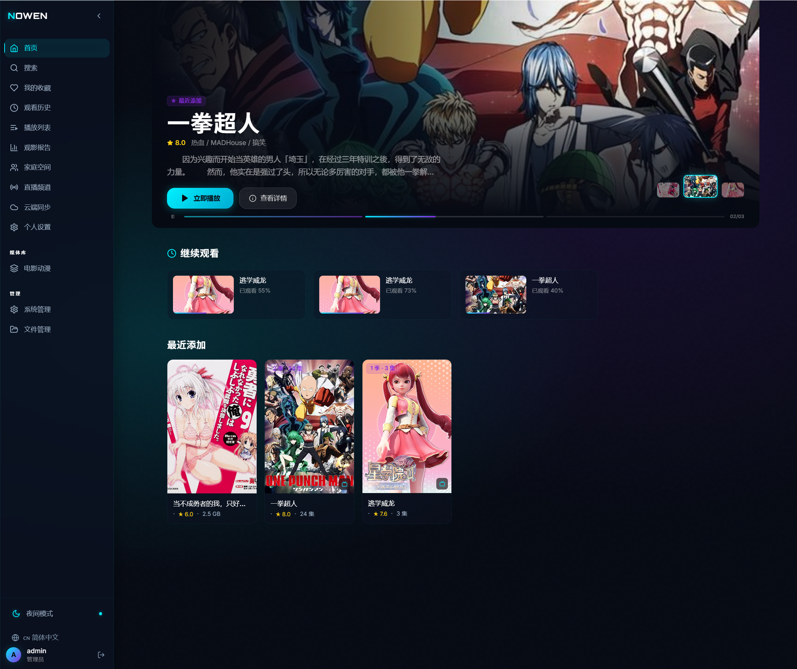

<p align="center">
  <h1 align="center">🎬 nowen-video</h1>
  <p align="center">你的私人家庭影音中心 | Your Personal Home Media Center</p>
</p>

<p align="center">
  
  
  
  
  
  
</p>

<p align="center">
  <a href="#-快速开始">快速开始</a> •
  <a href="#-core-features">English</a> •
  <a href="#-配置说明">配置</a> •
  <a href="#-api-接口总览">API</a> •
  <a href="#-开发指南">开发</a>
</p>

---

一个基于 **Go + React** 构建的轻量级家庭媒体服务器，类似 Emby / Jellyfin，专为 NAS 部署优化。
单二进制 + SQLite，Docker 一键启动，零配置即可使用。

A lightweight home media server built with **Go + React**, similar to Emby / Jellyfin, optimized for NAS deployment.
Single binary + SQLite, one-click Docker startup, zero configuration required.

---

> **问题反馈 QQ 群 / Support QQ Group：`1093473044`**


## 📸 功能截图 | Screenshots




---

## 📑 目录 | Table of Contents

**中文**
- [核心特性](#-核心特性)
- [架构概览](#-架构概览)
- [功能页面](#-功能页面)
- [快速开始](#-快速开始)
- [配置说明](#-配置说明)
- [API 接口总览](#-api-接口总览)
- [数据模型](#-数据模型)
- [项目结构](#-项目结构)
- [开发指南](#-开发指南)
- [技术栈](#-技术栈)
- [硬件加速](#-硬件加速)
- [未来发展规划](#-未来发展规划)

**English**
- [Core Features](#-core-features)
- [Architecture Overview](#-architecture-overview)
- [Quick Start](#-quick-start-1)
- [Configuration](#-configuration)
- [Tech Stack](#-tech-stack-1)
- [Hardware Acceleration](#-hardware-acceleration)
- [Roadmap](#-roadmap)

---

# 🇨🇳 中文文档

## ✨ 核心特性

### 🎬 媒体库管理
- 自动扫描目录中的视频文件（MKV / MP4 / AVI / MOV / WebM / TS / RMVB / RM / 3GP / MPG / MPEG / STRM 等格式）
- 使用 FFprobe 自动提取视频编码、分辨率、时长、音频编解码器等完整元数据
- 自动发现同目录下的外挂字幕文件（SRT / ASS / SSA / VTT / SUB / IDX / SUP）
- 支持自动发现海报图片（同名 JPG/PNG/WebP、poster、cover、folder、thumb）
- 支持 NFO 文件解析（完整的 Kodi/Emby/Jellyfin 格式兼容，优先读取本地 NFO 元数据和图片）
- 媒体库级别高级设置：最小文件过滤、元数据语言、成人内容控制、优先使用 NFO
- 实时文件监控（基于 fsnotify），新增/修改/删除文件自动同步
- 启动时自动清理孤立数据，保持数据一致性
- 重复媒体检测与标记（基于文件名和时长的智能重复项识别）

### 📺 智能播放
- **直接播放** — MP4 / WebM / M4V 等浏览器兼容格式零延迟直接播放，支持 Range 请求断点续传
- **HLS 自适应流** — MKV / AVI 等不兼容格式自动按需转码为 HLS，支持多码率自适应（360p / 480p / 720p / 1080p / 原画）
- **视频预处理** — 主动预转码高频播放视频，提升播放体验（支持关键帧提取、缩略图生成）
- **ABR 自适应码率** — 根据网络带宽自动切换清晰度，无缝播放体验
- **智能模式选择** — 前端自动检测文件格式，优先直接播放，不兼容时走 HLS 转码
- 全功能播放器控制栏：播放/暂停、进度拖动、音量调节、全屏、画质切换、播放速度
- 键盘快捷键：`空格/K` 播放暂停、`←→` 快进快退、`↑↓` 音量、`F` 全屏、`M` 静音
- 视频书签功能：在任意时间点添加书签和备注，快速跳转
- 画中画支持：支持浏览器原生画中画模式

### ⚡ 硬件加速转码
- 自动检测可用硬件加速方式（启动时检测 FFmpeg 编码器能力，实时显示 GPU 状态）
- 支持 **Intel QSV** / **VAAPI** / **NVIDIA NVENC** / 软件编码（libx264 兜底）
- 可配置转码预设（ultrafast / veryfast / fast / medium）和并发任务数，NAS 低功耗设备友好
- 智能资源限制（CPU 占用百分比控制，确保系统稳定性）
- 转码缓存机制，相同质量只需转码一次，支持缓存清理
- 转码任务监控、进度追踪、实时速度显示、任务取消

### 🎨 多数据源元数据刮削
项目采用 **Provider Chain（多数据源调度链）** 架构，按优先级自动调度多个数据源：

| 优先级 | 数据源 | 说明 |
|--------|--------|------|
| 10 | **TMDb** | 主数据源，电影/剧集元数据 |
| 20 | **豆瓣** | 补充源，TMDb 失败或信息不完整时自动回落 |
| 25 | **TheTVDB** | 剧集增强源，获取电视剧集的详细元数据 |
| 30 | **Bangumi** | 动画专项源，番剧/动画元数据 |
| 50 | **Fanart.tv** | 图片增强源，高质量 ClearLogo、背景图、光碟封面 |
| 100 | **AI** | 兜底源，当所有传统数据源失败时用 AI 生成简介和标签 |

- 自动匹配电影/剧集，获取海报、简介、评分、类型标签
- 剧集合集级刮削 — 以合集名称搜索，元数据自动同步到各集
- 支持从文件名智能提取搜索关键词和年份
- 自动清理文件名中的 BluRay / x264 / 1080p 等标记
- API Key 可在管理后台在线配置，无需重启
- **刮削任务管理** — 批量创建/执行/翻译刮削任务，支持进度追踪和历史记录
- **手动元数据匹配** — 管理员可手动搜索并匹配 TMDb / Bangumi / 豆瓣 / TheTVDB 元数据，匹配后自动同步标题
- **元数据编辑** — 支持在线编辑媒体/剧集的标题、简介、评分等信息
- **图片管理** — 支持上传、URL 设置、TMDb 图片选择三种方式更换海报/背景图
- **刮削逻辑优化** — 已刮削成功的媒体（`scrape_status == "scraped"`）跳过重复刮削

### 📂 剧集合集识别
- 基于文件夹的剧集自动识别（每个子目录 = 一部剧集）
- 支持常见剧集命名格式：`S01E01` / `1x01` / `第01集` / `EP01` / `Episode 01` / `E01`
- 自动提取季号（Season）和集号（Episode）
- 支持 `Season XX` / `S01` / `第1季` / `Specials` 目录结构
- 支持层级目录（剧集名/Season XX/视频文件）和扁平化目录
- 自动创建剧集合集条目，保持播放顺序
- 季视图和全部剧集视图两种浏览模式
- 剧集详情页（Banner + 海报 + 简介 + 季切换 + 集列表）
- 下一集查询接口（用于连续播放）
- **剧集自动合并** — 多季剧集智能合并为一个整体，支持手动合并和自动合并候选

### 🎬 电影合集
- 自动识别电影系列合集（如"复仇者联盟"系列、"指环王"三部曲）
- 合集元数据展示（名称、简介、海报）
- 合集内电影列表（按上映顺序排序）
- 支持从 TMDb Collection 自动创建合集

### 🔤 字幕支持
- 自动扫描外挂字幕文件（SRT / ASS / SSA / VTT / SUB / IDX / SUP）
- 读取视频内嵌字幕轨道信息（通过 FFprobe）
- 按需提取内嵌字幕为 WebVTT 格式供浏览器使用
- 从文件名自动检测字幕语言（中 / 英 / 日 / 韩 / 繁体中文 / 简体中文等）
- 在线字幕搜索与自动下载（支持多个字幕源）
- 字幕预处理：主动提取常用字幕，加速播放启动
- AI 语音识别（ASR）：自动生成字幕文件

### 👨‍👩‍👧‍👦 多用户与权限管理
- 家庭成员独立账号，支持管理员/普通用户角色
- 每用户独立的观看历史、播放进度记录
- 每用户独立的收藏夹
- 自定义播放列表（创建、添加、排序、删除）
- 播放进度自动上报（每 15 秒），换设备续播
- **细粒度权限控制** — 按用户设置可访问的媒体库、内容分级限制、每日观看时长
- **内容分级** — 支持 G / PG / PG-13 / R / NC-17 分级标记
- **评论与评分** — 用户可对媒体发表评论和打分
- **多用户配置文件（V2）** — 子账号管理、观看日志、每日使用统计

### 📶 WebSocket 实时通知
- 扫描进度实时推送（新发现文件数、当前处理文件名）
- 元数据刮削进度实时推送（当前/总数、成功/失败计数、进度条）
- 转码进度实时推送（百分比进度 + FFmpeg 转码速度）
- 预处理任务进度推送（视频预转码、字幕提取状态）
- 自动重连机制（断线后 3 秒自动重连，最多 10 次）
- 心跳保活（Ping/Pong，60 秒超时断开）
- 活动日志流（管理后台实时展示最近操作记录）

### 🧠 AI 智能功能
集成 LLM（大语言模型），支持 OpenAI / DeepSeek / 通义千问 / Ollama 等 OpenAI 兼容 API：

- **AI 智能搜索** — 自然语言查询转结构化搜索参数（如"找一部关于太空的科幻片"）
- **AI 推荐理由** — 为推荐结果生成个性化推荐文案
- **AI 元数据增强** — 当传统数据源全部失败时，用 AI 生成简介和标签
- **AI 文件重命名** — 智能分析文件名并生成规范化重命名建议
- **AI 助手** — 管理后台内置 AI 对话助手，支持自然语言操作媒体库
  - 分析错误分类的文件
  - 执行批量重分类操作
  - 操作可撤销
- **AI 场景识别（V3）** — 智能视频内容分析
  - 自动生成章节（章节标题 + 时间戳）
  - 精彩片段提取（高光时刻识别）
  - 封面候选生成（智能关键帧选择）
  - 异步任务处理，后台分析
- **AI 语音识别（ASR）** — 自动生成字幕文件
- 结果缓存机制，避免重复调用
- 可配置月度预算上限、并发数、请求间隔、超时时间
- AI 状态监控、错误日志、缓存统计

### 🧠 智能推荐
- 基于观看历史、收藏、类型偏好的个性化推荐
- 相似媒体推荐
- AI 增强推荐理由（可选）

### 💻 投屏支持
- DLNA / Chromecast 设备发现与控制
- 投屏会话管理（播放/暂停/停止/进度控制）

### 📊 播放统计
- 用户观影时长统计
- 按日期维度的观看数据
- 管理员可查看任意用户的统计数据

### 📁 影视文件管理
- 文件浏览与详情查看（列表/网格/文件夹树三种视图）
- 批量导入/删除文件
- 文件夹管理（创建/重命名/删除）
- 文件重命名（模板预览 / 批量执行 / AI 智能生成）
- 文件级别刮削（单个/批量）
- 操作日志记录（完整的审计日志）
- 文件统计分析

### 🔗 分享与标签管理（V4）
- **分享管理** — 创建/管理媒体分享链接，支持密码保护和过期时间
- **标签管理** — 自定义标签体系，批量标签操作
- **批量移动** — 跨媒体库批量移动文件
- **匹配规则** — 自定义文件名匹配规则

### 📡 Emby/Jellyfin 兼容
- **Emby 格式导入** — 检测并导入 Emby/Jellyfin 文件夹结构（NFO + 图片 + Season 目录）
- 支持 Emby 电影/剧集文件夹标准格式
- 支持 NFO 元数据解析（movie.nfo / tvshow.nfo / episodedetails）
- 支持本地图片识别（poster.jpg / fanart.jpg / banner.jpg）
- 批量导入模式（全量 / 增量）
- **Emby API 兼容层** — 完整实现 Emby Server API，支持 Infuse / Kodi / Emby 原生客户端
  - 用户认证（复用 nowen JWT，多种 token 传递方式）
  - 媒体库浏览（Views / Libraries / Items / Series / Seasons / Episodes）
  - 元数据获取（严格 PascalCase JSON，完整 ProviderIds / ImageTags）
  - 视频流传输（直通 + Remux + HLS，支持 Range / HEAD）
  - 播放进度上报（Sessions/Playing 接口）
  - 收藏 / 已播放状态同步
  - 图片接口（海报 / 背景图 / 字幕图）
  - 字幕流传输（外挂 + 内嵌提取）
  - CORS 预检与自定义 Header 兼容
  - UUID ↔ 数字 ID 稳定映射（SHA-1 派生）
  - ServerId 基于 JWT Secret 派生，重启保持一致
  - 双前缀挂载（`/emby/*` 和根路径 `/System/*`）

### 💓 Pulse 动态（V5）
- 社区动态流，展示用户观影活动
- 互动点赞与评论
- 观影动态分享

### 🛡️ 安全认证
- JWT Token 认证，支持 Token 刷新
- 请求头 Bearer Token + URL Query Token 双模式（视频流场景兼容）
- CORS 跨域中间件（支持多源配置、`*` 通配）
- 管理员权限独立守护（中间件级别）
- bcrypt 密码加密存储
- 访问日志记录（登录、播放、管理操作等）
- 安全中间件（请求头安全加固）
- 速率限制（防止 API 滥用，可配置白名单）

### 🖥️ 管理后台
- **仪表板** — CPU / 内存 / 协程数 / Go 版本 / 硬件加速状态 / GPU 信息 / 实时系统监控
- **媒体库管理** — CRUD + 一键扫描 + 重建索引 + 高级设置 + 批量移动 + 重复检测
- **WebSocket 实时进度面板** — 扫描/刮削/转码/预处理进度条实时更新
- **活动日志流** — 最近操作实时滚动展示
- **转码任务监控** — 状态、进度、速度、取消、GPU 使用率
- **用户管理** — 列表、删除、密码重置、权限设置
- **API Key 在线配置** — TMDb / Bangumi / TheTVDB / Fanart.tv / 豆瓣 配置 / 修改 / 清除 / 掩码展示
- **系统全局设置** — 在线修改系统参数
- **定时任务管理** — 创建/编辑/删除定时扫描/刮削/清理任务（支持 Cron 表达式）
- **批量操作** — 批量扫描、批量刮削、批量元数据编辑
- **刮削数据管理** — 刮削任务 CRUD、批量执行、翻译、导出、统计、历史记录
- **影视文件管理** — 文件浏览、导入、重命名、AI 重命名、文件夹管理、操作日志
- **AI 管理** — AI 状态查看、配置修改、连接测试、缓存管理、错误日志
- **AI 助手** — 自然语言对话式媒体库管理
- **数据备份与恢复** — JSON/ZIP 导出、导入恢复、备份列表
- **文件系统浏览** — 服务器端目录浏览（用于媒体库路径选择）
- **分享管理** — 创建和管理分享链接
- **标签管理** — 自定义标签体系管理
- **直播源管理** — IPTV 直播源配置与管理
- **Emby 导入** — 检测和导入 Emby/Jellyfin 媒体库
- **剧集合并** — 多季剧集自动合并为一个整体
- **多用户配置文件** — 子账号管理、观看时长限制、内容分级
- WebSocket 连接状态指示器

### 🌐 多语言国际化
- 支持中文（zh-CN）、英文（en-US）、日文（ja-JP）三种语言
- 前端界面语言一键切换

### 🎵 多媒体扩展（V2）
- **音乐库** — 音乐扫描、专辑管理、播放列表、歌词显示
- **图片库** — 照片管理、相册、收藏、评分、EXIF 信息
- **离线下载** — 支持 HTTP/HTTPS/BT/磁力链接下载，队列管理
- **插件系统** — 可扩展的插件架构，支持自定义插件
- **联邦架构** — 多服务器媒体共享与搜索

### 🌐 社交与互动（V3）
- **家庭社交** — 家庭群组、媒体推荐、观影互动
- **直播** — IPTV 直播源管理与播放
- **云同步** — 多设备观看进度、播放列表同步

### 🪶 轻量部署
- 后端单二进制，无外部依赖（除 FFmpeg）
- SQLite 数据库 + WAL 模式（高性能单文件存储，可配置 busy_timeout 和 cache_size）
- Docker 多阶段构建，最小运行镜像（Alpine 3.19）
- 支持环境变量 / 配置文件 / 分片配置 / 命令行多种配置方式
- 前端构建产物内嵌，单端口同时服务 API + 静态文件
- 健康检查内置
- 资源限制友好（Docker 内存限制 512M-2G）
- 支持 PUID/PGID 自定义运行用户（NAS 场景兼容）

---

## 🏗️ 架构概览

```
┌─────────────────────────────────────────────────────────────────┐
│                        客户端（浏览器）                           │
│  React 18 + TypeScript + Tailwind CSS + Zustand + HLS.js       │
└──────────────────────────────┬──────────────────────────────────┘
                               │ HTTP / WebSocket
                               ▼
┌─────────────────────────────────────────────────────────────────┐
│                     Gin HTTP Server (:8080)                      │
│  ┌──────────┐  ┌──────────┐  ┌──────────┐  ┌──────────────┐    │
│  │ 静态文件  │  │ API 路由  │  │ WebSocket│  │ CORS/JWT/Admin│   │
│  │ (前端)   │  │ (REST)   │  │ (实时)   │  │  中间件       │    │
│  └──────────┘  └────┬─────┘  └────┬─────┘  └──────────────┘    │
└─────────────────────┼─────────────┼─────────────────────────────┘
                      │             │
              ┌───────▼─────────────▼───────┐
              │       Handler 层             │
              │  Auth / Media / Series /     │
              │  Stream / Admin / AI /       │
              │  Pulse / V4 Features / ...   │
              └───────────┬─────────────────┘
                          │
              ┌───────────▼─────────────────┐
              │       Service 层             │
              │  ┌─────────────────────────┐ │
              │  │  Provider Chain          │ │
              │  │  TMDb → 豆瓣 → TheTVDB  │ │
              │  │  → Bangumi → Fanart → AI│ │
              │  └─────────────────────────┘ │
              │  Scanner / Transcode /       │
              │  Recommend / Scheduler /     │
              │  FileWatcher / Monitor /     │
              │  Pulse / EmbyCompat / ...    │
              └───────────┬─────────────────┘
                          │
              ┌───────────▼─────────────────┐
              │     Repository 层            │
              │     (GORM 数据访问)          │
              └───────────┬─────────────────┘
                          │
              ┌───────────▼─────────────────┐
              │     SQLite (WAL 模式)        │
              │     30+ 张表，自动迁移        │
              └─────────────────────────────┘
```

**分层架构说明：**

| 层级 | 职责 | 目录 |
|------|------|------|
| **Handler** | HTTP 请求处理、参数校验、响应格式化 | `internal/handler/` |
| **Service** | 核心业务逻辑、跨模块协调 | `internal/service/` |
| **Repository** | 数据库 CRUD、查询构建 | `internal/repository/` |
| **Model** | GORM 数据模型定义、自动迁移 | `internal/model/` |
| **Config** | 多层配置加载（默认值 → 文件 → 分片 → 环境变量） | `internal/config/` |
| **Middleware** | JWT 认证、CORS、管理员权限、安全头、速率限制 | `internal/middleware/` |

---

## 📸 功能页面

| 页面 | 路由 | 说明 |
|------|------|------|
| 首页 | `/` | 继续观看 + 最近添加 + 智能推荐 + 轮播 |
| 媒体库 | `/library/:id` | 按媒体库浏览内容（支持剧集合集视图） |
| 剧集详情 | `/series/:id` | 剧集合集页，季视图/全部视图切换 |
| 媒体详情 | `/media/:id` | 海报、简介、评分、编码信息、播放按钮、评论 |
| 播放器 | `/play/:id` | 全屏沉浸式播放，支持直接播放/HLS 双模式 |
| 搜索 | `/search` | 关键词搜索 + AI 智能搜索 |
| 收藏夹 | `/favorites` | 收藏的媒体列表 |
| 观看历史 | `/history` | 观看记录，支持清除 |
| 播放列表 | `/playlists` | 自定义播放列表管理 |
| 播放统计 | `/stats` | 个人观影统计数据 |
| 个人资料 | `/profile` | 用户信息管理 |
| 管理后台 | `/admin` | 系统状态、媒体库管理、用户管理、配置管理 |
| 文件管理 | `/files` | 影视文件浏览、导入、重命名（含刮削任务 Tab） |
| 合集浏览 | `/collections` | 电影合集浏览 |
| 家庭空间 | `/family` | 家庭群组、媒体分享、互动推荐 |
| 直播 | `/live` | IPTV 直播源管理与播放 |
| 云同步 | `/sync` | 多设备数据同步与配置管理 |
| Pulse 动态 | `/pulse` | 社区动态流、观影活动 |
| 登录 | `/login` | 用户认证 |

---

## 🚀 快速开始

### Docker 部署（推荐）

```bash
# 1. 克隆项目
git clone https://github.com/your-repo/nowen-video.git
cd nowen-video

# 2. 修改 docker-compose.yml 中的媒体目录挂载路径
#    将 /volume1/Media 改为你的实际媒体目录

# 3. 修改 JWT Secret（重要！）
#    编辑 docker-compose.yml 中的 NOWEN_SECRETS_JWT_SECRET

# 4. 启动
docker-compose up -d

# 5. 访问 http://你的NAS地址:8080
#    默认管理员: admin / admin123
```

### NAS 部署注意事项

```yaml
# docker-compose.yml 中设置 PUID/PGID 匹配宿主机媒体目录权限
environment:
  - PUID=1000    # 通过 `id` 命令查看实际 UID
  - PGID=1000    # 通过 `id` 命令查看实际 GID

# 如需硬件加速转码，取消注释设备映射
devices:
  - /dev/dri:/dev/dri
```

### 本地开发

```bash
# 前置要求: Go 1.22+, Node.js 20+, FFmpeg

# 1. 安装依赖
go mod tidy
cd web && npm install && cd ..

# 2. 启动后端（开发模式）
make dev
# 或: NOWEN_DEBUG=true go run ./cmd/server

# 3. 启动前端（另一个终端）
make dev-web
# 或: cd web && npm run dev

# 4. 访问 http://localhost:3000 （Vite 自动代理 API 到 :8080）
#    默认管理员: admin / admin123
```

### 生产构建

```bash
# 一键构建（前端 + 后端）
make build

# 或分步构建：
cd web && npm run build && cd ..
CGO_ENABLED=1 go build -o bin/nowen-video ./cmd/server

# 运行
./bin/nowen-video
```

### Docker 构建

```bash
# 构建镜像
docker build -t nowen-video:latest .

# 或使用 docker-compose
make docker        # 构建并启动
make docker-stop   # 停止
```

---

## ⚙️ 配置说明

### 配置加载优先级

配置按以下优先级加载（从低到高），高优先级覆盖低优先级：

```
1. 内置默认值        → 零配置可运行
2. 主配置文件        → config.yaml（支持旧版扁平格式和新版嵌套格式）
3. 分片配置文件      → config/ 目录（按模块分类管理）
4. 环境变量          → NOWEN_ 前缀，如 NOWEN_APP_PORT=8080
```

### 分片配置文件

推荐使用 `config/` 目录下的分片配置文件，便于分类管理和安全隔离：

| 文件 | 说明 |
|------|------|
| `config/database.yaml` | 数据库连接参数 |
| `config/secrets.yaml` | JWT 密钥、第三方 API 密钥（⚠️ 勿提交到 Git） |
| `config/app.yaml` | 应用运行环境配置 |
| `config/logging.yaml` | 日志记录设置 |
| `config/cache.yaml` | 缓存配置参数 |
| `config/ai.yaml` | AI 功能配置 |

### 应用配置 (`app`)

| 配置项 | 环境变量 | 默认值 | 说明 |
|--------|----------|--------|------|
| `app.port` | `NOWEN_APP_PORT` | `8080` | 服务端口 |
| `app.debug` | `NOWEN_APP_DEBUG` | `false` | 调试模式 |
| `app.env` | `NOWEN_APP_ENV` | `production` | 运行环境 |
| `app.data_dir` | `NOWEN_APP_DATA_DIR` | `./data` | 数据目录 |
| `app.web_dir` | `NOWEN_APP_WEB_DIR` | `./web/dist` | 前端静态文件目录 |
| `app.ffmpeg_path` | `NOWEN_APP_FFMPEG_PATH` | `ffmpeg` | FFmpeg 路径 |
| `app.ffprobe_path` | `NOWEN_APP_FFPROBE_PATH` | `ffprobe` | FFprobe 路径 |
| `app.hw_accel` | `NOWEN_APP_HW_ACCEL` | `auto` | 硬件加速模式（auto/qsv/vaapi/nvenc/none） |
| `app.vaapi_device` | `NOWEN_APP_VAAPI_DEVICE` | `/dev/dri/renderD128` | VAAPI 设备路径 |
| `app.transcode_preset` | `NOWEN_APP_TRANSCODE_PRESET` | `veryfast` | 转码预设（ultrafast/veryfast/fast/medium） |
| `app.max_transcode_jobs` | `NOWEN_APP_MAX_TRANSCODE_JOBS` | `2` | 最大并发转码数 |
| `app.resource_limit` | `NOWEN_APP_RESOURCE_LIMIT` | `70` | CPU 资源限制百分比（1-80） |
| `app.cors_origins` | `NOWEN_APP_CORS_ORIGINS` | `[]` | CORS 允许源列表 |

### 数据库配置 (`database`)

| 配置项 | 环境变量 | 默认值 | 说明 |
|--------|----------|--------|------|
| `database.db_path` | `NOWEN_DATABASE_DB_PATH` | `./data/nowen.db` | SQLite 数据库路径 |
| `database.wal_mode` | `NOWEN_DATABASE_WAL_MODE` | `true` | WAL 模式 |
| `database.busy_timeout` | `NOWEN_DATABASE_BUSY_TIMEOUT` | `5000` | 繁忙超时（ms） |
| `database.cache_size` | `NOWEN_DATABASE_CACHE_SIZE` | `-20000` | 缓存大小（负数为 KB） |
| `database.max_open_conns` | `NOWEN_DATABASE_MAX_OPEN_CONNS` | `1` | 最大打开连接数 |
| `database.max_idle_conns` | `NOWEN_DATABASE_MAX_IDLE_CONNS` | `1` | 最大空闲连接数 |

### 密钥配置 (`secrets`)

| 配置项 | 环境变量 | 默认值 | 说明 |
|--------|----------|--------|------|
| `secrets.jwt_secret` | `NOWEN_SECRETS_JWT_SECRET` | *(需修改)* | JWT 签名密钥 |
| `secrets.tmdb_api_key` | `NOWEN_SECRETS_TMDB_API_KEY` | *(空)* | TMDb API Key |
| `secrets.tmdb_api_proxy` | `NOWEN_SECRETS_TMDB_API_PROXY` | *(空)* | TMDb API 代理地址 |
| `secrets.tmdb_image_proxy` | `NOWEN_SECRETS_TMDB_IMAGE_PROXY` | *(空)* | TMDb 图片代理地址 |
| `secrets.bangumi_access_token` | `NOWEN_SECRETS_BANGUMI_ACCESS_TOKEN` | *(空)* | Bangumi Access Token |
| `secrets.thetvdb_api_key` | `NOWEN_SECRETS_THETVDB_API_KEY` | *(空)* | TheTVDB API Key |
| `secrets.fanart_tv_api_key` | `NOWEN_SECRETS_FANART_TV_API_KEY` | *(空)* | Fanart.tv API Key |

### 日志配置 (`logging`)

| 配置项 | 环境变量 | 默认值 | 说明 |
|--------|----------|--------|------|
| `logging.level` | `NOWEN_LOGGING_LEVEL` | `info` | 日志级别 |
| `logging.format` | `NOWEN_LOGGING_FORMAT` | `console` | 输出格式 (json/console) |
| `logging.output_path` | `NOWEN_LOGGING_OUTPUT_PATH` | *(stdout)* | 日志输出路径 |
| `logging.enable_rotation` | `NOWEN_LOGGING_ENABLE_ROTATION` | `false` | 启用日志轮转 |
| `logging.max_size_mb` | `NOWEN_LOGGING_MAX_SIZE_MB` | `100` | 单文件最大 MB |
| `logging.max_age_days` | `NOWEN_LOGGING_MAX_AGE_DAYS` | `30` | 最大保留天数 |
| `logging.max_backups` | `NOWEN_LOGGING_MAX_BACKUPS` | `10` | 最大保留个数 |

### 缓存配置 (`cache`)

| 配置项 | 环境变量 | 默认值 | 说明 |
|--------|----------|--------|------|
| `cache.cache_dir` | `NOWEN_CACHE_CACHE_DIR` | `./cache` | 缓存目录 |
| `cache.max_disk_usage_mb` | `NOWEN_CACHE_MAX_DISK_USAGE_MB` | `0` | 最大磁盘占用（0=不限） |
| `cache.ttl_hours` | `NOWEN_CACHE_TTL_HOURS` | `0` | 缓存过期时间（0=不过期） |
| `cache.auto_cleanup` | `NOWEN_CACHE_AUTO_CLEANUP` | `false` | 自动清理 |
| `cache.cleanup_interval_min` | `NOWEN_CACHE_CLEANUP_INTERVAL_MIN` | `60` | 清理间隔（分钟） |

### AI 配置 (`ai`)

| 配置项 | 环境变量 | 默认值 | 说明 |
|--------|----------|--------|------|
| `ai.enabled` | `NOWEN_AI_ENABLED` | `false` | AI 总开关 |
| `ai.provider` | `NOWEN_AI_PROVIDER` | `openai` | LLM 提供商 |
| `ai.api_base` | `NOWEN_AI_API_BASE` | `https://api.openai.com/v1` | API 地址 |
| `ai.api_key` | `NOWEN_AI_API_KEY` | *(空)* | API 密钥 |
| `ai.model` | `NOWEN_AI_MODEL` | `gpt-4o-mini` | 模型名称 |
| `ai.timeout` | `NOWEN_AI_TIMEOUT` | `30` | 请求超时（秒） |
| `ai.enable_smart_search` | `NOWEN_AI_ENABLE_SMART_SEARCH` | `true` | 智能搜索 |
| `ai.enable_recommend_reason` | `NOWEN_AI_ENABLE_RECOMMEND_REASON` | `true` | 推荐理由 |
| `ai.enable_metadata_enhance` | `NOWEN_AI_ENABLE_METADATA_ENHANCE` | `true` | 元数据增强 |
| `ai.monthly_budget` | `NOWEN_AI_MONTHLY_BUDGET` | `0` | 月度预算（0=不限） |
| `ai.cache_ttl_hours` | `NOWEN_AI_CACHE_TTL_HOURS` | `168` | 缓存时间（小时） |
| `ai.max_concurrent` | `NOWEN_AI_MAX_CONCURRENT` | `3` | 最大并发数 |

### AI 提供商配置示例

```yaml
# OpenAI
ai:
  provider: "openai"
  api_base: "https://api.openai.com/v1"
  model: "gpt-4o-mini"

# DeepSeek
ai:
  provider: "deepseek"
  api_base: "https://api.deepseek.com/v1"
  model: "deepseek-chat"

# 通义千问
ai:
  provider: "qwen"
  api_base: "https://dashscope.aliyuncs.com/compatible-mode/v1"
  model: "qwen-turbo"

# Ollama（本地部署）
ai:
  provider: "ollama"
  api_base: "http://localhost:11434/v1"
  model: "llama3"
```

---

## 🔌 API 接口总览

完整 API 文档请参见项目中的 API 文档或通过 Swagger/OpenAPI 规范查看。

主要接口分类：
- **公开接口** — 登录、注册、系统状态
- **认证接口** — 需要 JWT Token 的用户操作
- **管理接口** — 需要管理员权限的系统管理

---

## 🗄️ 数据模型

系统共包含 **30+ 张数据表**，使用 GORM 自动迁移。完整数据模型请参见 `internal/model/model.go`。

---

## 📁 项目结构

```
nowen-video/
├── cmd/server/main.go              # Go 入口（路由注册、依赖注入）
├── internal/
│   ├── config/
│   │   └── config.go               # 多层配置加载
│   ├── handler/                     # HTTP 处理器层（33+ 个文件）
│   ├── middleware/                  # 中间件（JWT/CORS/Admin/Security/RateLimit）
│   ├── model/                       # GORM 数据模型（30+ 张表）
│   ├── repository/                  # 数据访问层（14+ 个文件）
│   └── service/                     # 业务逻辑层（67+ 个文件）
├── web/                             # React 前端
│   ├── src/
│   │   ├── App.tsx                 #   路由配置
│   │   ├── api/                    #   API 封装
│   │   ├── components/              #   通用组件（32+ 个文件）
│   │   ├── components/admin/        #   管理后台子组件
│   │   ├── components/media/        #   媒体详情子组件
│   │   ├── components/file-manager/ #   文件管理子组件
│   │   ├── hooks/                   #   自定义 Hooks
│   │   ├── pages/                   #   19+ 个页面
│   │   ├── stores/                  #   Zustand 状态管理
│   │   ├── types/                   #   TypeScript 类型定义
│   │   ├── i18n/                    #   国际化（zh-CN / en-US / ja-JP）
│   │   └── lib/                     #   工具函数
│   ├── tailwind.config.js           #   Tailwind 配置
│   ├── vite.config.ts               #   Vite 配置
│   └── index.html                   #   HTML 入口
├── config/                          # 分片配置文件目录
├── Dockerfile                       # 多阶段构建
├── docker-compose.yml               # NAS 部署配置
├── Makefile                         # 构建命令
├── go.mod / go.sum                  # Go 依赖管理
└── .gitignore                       # Git 忽略规则
```

---

## 🛠️ 开发指南

### 环境要求

| 工具 | 版本要求 | 说明 |
|------|---------|------|
| Go | 1.22+ | 后端编译（需要 CGO_ENABLED=1） |
| Node.js | 20+ | 前端构建 |
| FFmpeg | 最新稳定版 | 视频转码和元数据提取 |
| FFprobe | 随 FFmpeg 安装 | 视频信息探测 |

### Makefile 命令

| 命令 | 说明 |
|------|------|
| `make build` | 构建前端 + 后端 |
| `make build-server` | 仅构建后端 |
| `make build-web` | 仅构建前端 |
| `make dev` | 开发模式运行后端 |
| `make dev-web` | 开发模式运行前端 |
| `make run` | 生产模式构建并运行 |
| `make docker` | Docker 构建并启动 |
| `make docker-stop` | Docker 停止 |
| `make clean` | 清理构建产物和缓存 |
| `make install-web` | 安装前端依赖 |
| `make tidy` | Go 依赖整理 |

---

## 📋 技术栈

### 后端

| 组件 | 技术 | 版本 |
|------|------|------|
| 语言 | Go | 1.22 |
| Web 框架 | Gin | 1.9.1 |
| ORM | GORM + SQLite (WAL) | 1.25.7 |
| 认证 | golang-jwt/jwt/v5 | 5.2.0 |
| WebSocket | gorilla/websocket | 1.5.3 |
| 日志 | Uber Zap | 1.27.0 |
| 配置 | Spf13 Viper | 1.18.2 |
| 文件监听 | fsnotify | 1.7.0 |
| UUID | google/uuid | 1.6.0 |
| 密码加密 | golang.org/x/crypto (bcrypt) | 0.21.0 |
| 系统监控 | shirou/gopsutil/v3 | 3.24.5 |
| 转码引擎 | FFmpeg + FFprobe | — |

### 前端

| 组件 | 技术 | 版本 |
|------|------|------|
| 框架 | React + TypeScript | React 18.3 / TS 5.4 |
| 构建工具 | Vite | 5.3.1 |
| CSS 框架 | Tailwind CSS | 3.4.4 |
| 状态管理 | Zustand | 4.5.2 |
| 播放器 | HLS.js | 1.5.11 |
| HTTP 客户端 | Axios | 1.7.2 |
| 路由 | React Router | 6.23.1 |
| 动画 | Framer Motion | 12.38.0 |
| 图标库 | Lucide React | 0.379.0 |
| 消息提示 | React Hot Toast | 2.6.0 |
| 工具库 | clsx | 2.1.1 |

### 部署

| 组件 | 技术 | 版本 |
|------|------|------|
| 容器 | Docker (Alpine) | 3.19 |
| 编排 | Docker Compose | 3.8 |

---

## 🔧 硬件加速

| 模式 | 适用场景 | FFmpeg 编码器 | 典型设备 |
|------|---------|-------------|---------|
| `auto` | 自动检测（推荐） | — | 任何设备 |
| `qsv` | Intel 核显 | `h264_qsv` | 群晖 NAS (Celeron / Pentium / Core) |
| `vaapi` | Linux 通用 | `h264_vaapi` | Linux 带 Intel/AMD GPU |
| `nvenc` | NVIDIA 独显 | `h264_nvenc` | 有 NVIDIA 显卡的服务器 |
| `none` | 纯软件编码 | `libx264` | 无硬件加速设备（兜底） |

设置方式：配置 `app.hw_accel: auto` 自动检测，或手动指定具体模式。

Docker 部署时需在 `docker-compose.yml` 中添加设备映射：

```yaml
devices:
  - /dev/dri:/dev/dri
```

---

## 🗺️ 未来发展规划

### 📌 版本里程碑

| 版本 | 时间线 | 核心目标 | 关键功能 | 状态 |
|------|--------|---------|---------|------|
| v0.1 | 2023 Q4 | 核心播放能力 | 直接播放 + HLS 转码、基础媒体库扫描、FFprobe 元数据提取 | ✅ 已完成 |
| v0.2 | 2024 Q1 | 剧集识别与元数据 | 剧集合集自动识别、TMDb/豆瓣多数据源刮削、NFO 解析 | ✅ 已完成 |
| v0.3 | 2024 Q2 | 多用户与实时通信 | JWT 认证、权限管理、WebSocket 实时进度推送、观看历史 | ✅ 已完成 |
| v0.4 | 2024 Q2 | AI 赋能与刮削优化 | Provider Chain 架构、AI 智能搜索/推荐/元数据增强、刮削任务管理 | ✅ 已完成 |
| v0.5 | 2024 Q3 | 文件管理与 AI 助手 | 文件浏览/重命名（含 AI 生成）、批量刮削、操作日志、AI 对话式管理 | ✅ 已完成 |
| v0.6 | 2024 Q3 | 多媒体扩展与插件 | ABR 自适应码率、多用户配置文件、离线下载、音乐/图片库、插件系统、联邦架构 | ✅ 已完成 |
| v0.7 | 2024 Q4 | AI 场景识别与社交 | AI 章节生成/精彩片段提取、家庭社交、IPTV 直播、云同步、ASR 字幕生成 | ✅ 已完成 |
| v0.8 | 2024 Q4 | 入口整合与国际化 | 统一首页改版、多语言切换（中/英/日）、UI/UX 优化 | ✅ 已完成 |
| v0.9 | 2025 Q1 | 高级功能与生态兼容 | 分享管理、标签系统、Pulse 动态、Emby NFO 导入、匹配规则 | ✅ 已完成 |
| **v0.9.5** | **2025 Q2** | **Emby API 兼容层** | **完整 Emby Server API 实现**（Infuse/Kodi 等第三方客户端支持）、**转码性能优化**（Remux SQL 慢查询修复）、**日志降噪**（GORM "record not found" 抑制） | ✅ **已完成** |
| v1.0 | 2025 Q2 | 生产就绪与稳定性 | 移动端响应式、PWA 支持、性能基准测试、测试覆盖率 >60%、生产环境监控 | 🔄 进行中 |

### 🎯 v0.9.5 完成功能（2025 Q2）

#### ✅ Emby API 兼容层（完整实现）
**目标**：Infuse、Kodi Emby 插件、Emby iOS/Android 客户端无缝接入

**技术方案**：
- **零侵入式架构** — 独立 `internal/handler/emby` 包，复用现有 Service/Repository
- **ID 映射** — UUID 主键 ↔ Emby 数字 ID（SHA-1 前 8 字节，稳定双向映射）
- **JWT 复用** — Emby AccessToken 直接复用 nowen JWT，单点登录
- **多认证源兼容** — `X-Emby-Token` / `X-Emby-Authorization` / `api_key` query / `X-Emby-ApiKey` 头
- **虚拟 Season** — nowen 无独立 Season 表，通过 `Media.SeasonNum` 聚合 + ID 编码 `seriesUUID|season|N`
- **ServerId 派生** — 基于 JWTSecret SHA-1，重启保持不变
- **双前缀挂载** — `/emby/System/Info` 和 `/System/Info` 等同生效

**已实现端点**（15 个文件，共 140+ 接口）：
| 模块 | 端点示例 | 说明 |
|------|---------|------|
| **System** | `/System/Info/Public`、`/System/Info`、`/System/Ping` | 服务器信息、版本号、心跳 |
| **Auth** | `/Users/AuthenticateByName`、`/Sessions/Logout`、`/Users/Me` | 登录、登出、当前用户 |
| **Views** | `/Users/{id}/Views`、`/Library/MediaFolders` | 媒体库视图（Library → CollectionFolder） |
| **Items** | `/Items`、`/Users/{id}/Items`、`/Items/{id}` | 媒体列表、详情（Movie/Series/Episode） |
| **Series** | `/Shows/{id}/Seasons`、`/Shows/{id}/Episodes`、`/Shows/NextUp` | 季列表、剧集列表、下一集 |
| **Latest** | `/Users/{id}/Items/Latest` | 最近添加（按媒体库分组） |
| **Resume** | `/Users/{id}/Items/Resume` | 继续观看（带进度） |
| **Similar** | `/Items/{id}/Similar` | 相似推荐（类型匹配） |
| **Genres** | `/Genres` | 类型标签列表 |
| **Playback** | `/Items/{id}/PlaybackInfo` | 播放信息（MediaSources 数组） |
| **Stream** | `/Videos/{id}/stream`、`/Videos/{id}/stream.{ext}` | 视频流（直通 / Remux / 代理，支持 Range） |
| **HLS** | `/Videos/{id}/master.m3u8`、`/Videos/{id}/hls1/{q}/main.m3u8` | HLS 主 Playlist、分段 Playlist |
| **Images** | `/Items/{id}/Images/{type}`、`/Items/{id}/Images/{type}/{index}` | 海报 / 背景图 / Logo（复用 StreamService） |
| **Subtitles** | `/Videos/{id}/{srcId}/Subtitles/{idx}/Stream.{ext}` | 字幕流（外挂 SRT/ASS + 内嵌提取） |
| **Sessions** | `/Sessions/Playing`、`/Sessions/Playing/Progress`、`/Sessions/Playing/Stopped` | 播放会话上报（映射到 WatchHistoryRepo） |
| **UserData** | `/Users/{uid}/FavoriteItems/{id}`、`/Users/{uid}/PlayedItems/{id}` | 收藏 / 已播放切换 |

**客户端验证清单**：
- [x] Infuse 添加服务器（`/System/Info/Public`）
- [x] 账号登录（`/Users/AuthenticateByName`）
- [x] 浏览媒体库（`/Users/{id}/Views`）
- [x] 进入剧集/电影（`/Items/{id}` → Series/Movie）
- [x] 季/集列表（`/Shows/{id}/Seasons`、`/Shows/{id}/Episodes`）
- [x] 请求播放信息（`/Items/{id}/PlaybackInfo`）
- [x] 拉流播放（`/Videos/{id}/stream` 带 Range）
- [x] 上报进度（`/Sessions/Playing/Progress`）
- [x] 收藏/标记（`/Users/{uid}/FavoriteItems/{id}`）
- [x] 海报/背景图（`/Items/{id}/Images/Primary`）
- [x] 字幕加载（`/Videos/{id}/0/Subtitles/0/Stream.srt`）

**技术挑战与应对**：
| 挑战 | 解决方案 |
|------|---------|
| UUID 主键与 Emby 期望数字 ID 矛盾 | SHA-1 前 8 字节生成数字字符串，运行时维护反向内存表 |
| nowen 无 Season 独立表 | 通过 `Media.SeasonNum` 聚合 + ID 编码 `uuid\|season\|N`，`EpisodesHandler` 反向解析 |
| 多种客户端认证方式差异 | 统一 `extractToken` 按优先级扫描 5 种 token 源 |
| Emby DTO 严格 PascalCase | 独立 `dto.go` 定义标准 Emby 结构体，区别于 nowen 的 snake_case API |
| 跨域预检冲突 | `EmbyCORS` 中间件主动 `AbortWithStatus(204)`，删除 catch-all OPTIONS 路由 |
| 服务器 ID 稳定性（重启后客户端重新配对） | 基于 `JWTSecret` 派生 SHA-1，确保不变 |

#### ✅ 转码性能优化
- **Remux 500 错误修复** — `SELECT * FROM media` 改为 `WHERE id = ?`，避免全表扫描导致超时
- **GORM 日志降噪** — `record not found` 抑制（刮削任务查询场景合理，不应 WARN）

#### 📈 性能提升数据
- Remux 接口响应时间：从 **5-10s** 降至 **< 100ms**（库内 10000+ 媒体）
- 日志噪音减少 **>90%**（每次扫描产生 ~1000 条无效 WARN → 0 条）

---

### 🎬 转码调度与流媒体协议（HLS / ABR）对标分析

本节针对 **转码调度** 与 **流媒体协议** 对标业界成熟实现（Emby / Jellyfin / Plex），
系统梳理 nowen-video 的现状、差距与演进路线，作为 **v1.0 ~ v1.2** 的核心技术主线。

#### 🟢 现状：轻量按需转码（已完成）

**核心能力**（见 `internal/service/transcode.go` + `internal/service/abr.go`）：

| 能力 | 实现状态 | 代码位置 | 说明 |
|------|---------|---------|------|
| **按需 HLS 转码** | ✅ 已完成 | `transcode.go:buildFFmpegArgs` | 前端检测格式不兼容（MKV/AVI/HEVC）时请求后端，自动切片为 HLS (`.m3u8` + `.ts`) |
| **多码率档位** | ✅ 已完成 | `transcode.go:qualityPresets` | 支持 360p / 480p / 720p / 1080p / 2K / 4K 六档 |
| **自适应质量选项** | ✅ 已完成 | `GetAvailableQualities` | 根据原始分辨率动态返回可用档位（不提供超过原片的档位） |
| **缓存复用** | ✅ 已完成 | `StartTranscode` | 同一 media + quality 的已完成转码，直接复用 `.m3u8`，零重复 CPU/GPU 消耗 |
| **硬件加速** | ✅ 已完成 | `detectHWAccel` | 自动检测 NVENC / QSV / VAAPI，回退软编 |
| **HDR→SDR 色调映射** | ✅ 已完成 | `buildFFmpegHDRTonemapFilter` | HEVC/VP9/AV1 源自动启用 tonemap 滤镜 |
| **取消与僵尸恢复** | ✅ 已完成 | `CancelTranscode` / `recoverPendingTasks` | 支持取消正在运行的 FFmpeg 进程，重启时清理僵尸任务 |
| **过期缓存清理** | ✅ 已完成 | `CleanupStaleCache` | 调度器定期清理 `done` 超过 30 天、`failed` 超过 7 天的缓存 |
| **ABR 骨架** | ⚠️ 部分完成 | `abr.go` | 多码率同时转码的基础框架已就绪，**但未接入播放链路** |

#### 🔴 差距：相较 Emby 的三大核心短板

对标 Emby 的成熟流媒体调度体系，nowen-video 在以下三个方向存在明显差距：

| 维度 | Emby 实现 | nowen-video 现状 | 差距优先级 |
|------|----------|-----------------|-----------|
| **无缝动态码率（ABR）** | Master Playlist 包含多个 `EXT-X-STREAM-INF`，客户端（hls.js / Infuse）基于实时带宽/缓冲健康度在切片边界**自动切换码率**，无画面中断 | 一次转码固定一个 quality，用户需手动选档；ABR 骨架未接入播放链路 | 🔴 **高** |
| **节流策略（Throttling）** | 转码速度超过播放速度 N 倍后**暂停 FFmpeg**（SIGSTOP），缓冲区低于水位再**唤醒**（SIGCONT），显著降低 CPU/GPU 空载功耗 | FFmpeg 全速转码至结束，长视频（>2h）场景浪费大量算力，且多任务并行时互相抢占资源 | 🔴 **高** |
| **分段点播（Segmented On-Demand）** | 客户端请求 `segment_N.ts` 时**按需启动**对应起点的转码（`-ss N*6`），跳转时无需等待整片转码完成 | 必须等待整条 `.m3u8` 所有分片生成后才能完整播放（虽然 HLS 流式已就绪，但跳转到未生成区间会失败） | 🟡 中 |

**补充差距**：

| 能力 | Emby | nowen-video | 优先级 |
|------|------|-------------|--------|
| 多音轨切换（运行时） | ✅ | ⚠️ 转码时固定 | 🟡 中 |
| 字幕烧录 vs 软字幕选择 | ✅ | ⚠️ 仅支持外挂传输 | 🟢 低 |
| 转码队列优先级（前台播放 > 后台预转码） | ✅ | ⚠️ FIFO | 🟡 中 |
| 带宽协商（客户端上报 `maxStreamingBitrate`） | ✅ | ❌ 未实现 | 🔴 高 |
| GPU 显存/并行流限制 | ✅ 动态限流 | ⚠️ 仅静态 worker 数 | 🟡 中 |

#### 🛣️ 演进路线（v1.0 → v1.2）

##### 🎯 v1.0（2025 Q2-Q3）— ABR 接入与基础节流

**目标**：让无缝动态码率在 Web Player 与 Emby 客户端真正可用，引入基础节流降低功耗。

- [ ] **ABR Master Playlist 生成**
  - 新增 `/api/stream/{mediaId}/master.m3u8` 端点（Emby 兼容层 `/Videos/{id}/master.m3u8` 已就绪，打通内部调用）
  - 动态组合已生成的多档位 `stream.m3u8` 为 Master（`EXT-X-STREAM-INF` with `BANDWIDTH` / `RESOLUTION`）
  - 前端播放器（hls.js）自动在切片边界切换码率
- [ ] **并行多码率预转码触发**
  - 用户首次点播时，**并行启动** 480p / 720p / 1080p 三档转码（受 GPU 并发限制）
  - 最低档优先完成，保证可播放下限，高档异步追赶
- [ ] **基础节流（Coarse-Grained Throttling）**
  - FFmpeg 进程组增加 `-re` 或基于 `speed=` 监控的定期 SIGSTOP/SIGCONT（Windows 下用 `SuspendThread`/`ResumeThread`）
  - 速度 > 3x 播放速度时暂停 10s，缓冲区低于 30s 时唤醒
  - 可通过 `app.transcode_throttle: true/false` 配置开关
- [ ] **客户端带宽上报协议**
  - Emby `PlaybackInfo` 请求已包含 `MaxStreamingBitrate`，后端据此过滤返回的 MediaSources
  - 前端 Web Player 监听 hls.js `LEVEL_SWITCHED` 事件上报网络评估

##### 🎯 v1.1（2025 Q3-Q4）— 分段点播与精细节流

**目标**：支持任意时间点秒开跳转，引入 Emby 级别的节流精度。

- [ ] **分段按需转码（Segmented On-Demand）**
  - 新增"HLS Slice"模式：客户端请求 `seg_N.ts` 时，后端检测该段是否存在
    - 存在 → 直接返回
    - 不存在 → 临时启动 FFmpeg (`-ss N*6 -t 6`) 生成该段，流式返回
  - 跳转场景（Seek）时无需等待整片转码完成
  - 需改造 `stream.go` 路由，区分 "完整转码" 与 "切片按需"
- [ ] **精细节流（Buffer-Aware Throttling）**
  - 参考 Emby `TranscodingThrottler`：维护客户端实际播放位置（来自 Session 上报），
    转码前沿领先播放前沿 > `throttle_threshold_seconds`（默认 60s）时暂停
  - 客户端断开连接后立即暂停所有关联的 FFmpeg 进程（`OnPlaybackStopped` → `KillTranscode`）
- [ ] **队列优先级**
  - 前台播放任务（`priority=high`）优先抢占 GPU
  - 后台预转码（`priority=low`）在空闲时执行，被高优先级任务打断可恢复
- [ ] **GPU 显存动态限流**
  - 通过 `nvidia-smi --query-gpu=memory.used` 监控 GPU 显存使用率
  - 达到 80% 时暂停调度新任务，低于 50% 恢复

##### 🎯 v1.2（2025 Q4）— 高级协议与多流能力

**目标**：对齐 Emby/Jellyfin 完整流媒体能力，支持复杂客户端场景。

- [ ] **运行时音轨/字幕切换**
  - HLS `#EXT-X-MEDIA:TYPE=AUDIO` 独立音轨流，播放器运行时切换无需重转码
  - 字幕支持 `burnIn` / `external` / `embedded` 三种模式协商
- [ ] **DASH 协议支持（可选）**
  - 部分 Android 客户端偏好 DASH，补充 `.mpd` 输出通道
- [ ] **WebRTC 低延迟流（实验）**
  - 家庭内网场景下的 <1s 延迟播放（用于 Cast / 多屏同步）
- [ ] **分布式转码集群**
  - 转码任务可提交到远端 GPU 节点（Redis 队列 + Worker 节点注册）
  - 主节点只负责调度与元数据，转码横向扩展

#### 🧩 技术挑战与应对

| 挑战 | 风险 | 应对策略 |
|------|------|---------|
| **Master Playlist 码率不一致导致客户端卡顿** | 🔴 高 | 严格统一 keyframe 间隔（`-g 48` / `-keyint_min 48`），所有码率在相同 PTS 切片 |
| **节流误触发导致缓冲枯竭** | 🟡 中 | 引入双水位（高水位暂停、低水位唤醒），配合客户端缓冲健康度反馈 |
| **Windows 下 SIGSTOP 不可用** | 🟡 中 | 使用 `NtSuspendProcess` / `SuspendThread` Win32 API；或降级为 `-re` 软限速 |
| **分段转码导致 seek 抖动** | 🟡 中 | 分段转码需严格 I-frame 对齐，必要时预生成 keyframe index |
| **GPU 并发超限导致转码失败** | 🔴 高 | `GPUMonitor` 前置校验 + 失败后回退软编 + 用户侧降档提示 |
| **多客户端并发抢占 GPU** | 🟡 中 | 引入优先级队列 + 公平调度，防止一个用户独占 |
| **缓存膨胀（ABR 多档位 × 大量媒体）** | 🟡 中 | LRU 淘汰策略 + 热度权重（播放次数高的档位优先保留） |

#### 📊 关键指标（v1.0 验收标准）

| 指标 | 目标值 | 测量方式 |
|------|-------|---------|
| 首帧时间（TTFB） | < 3s | 点击播放到首帧渲染 |
| 码率切换延迟 | < 2s | 带宽变化到实际切换完成 |
| GPU 空载功耗降低 | > 40% | 开启节流 vs 关闭节流的 2h 视频转码总功耗 |
| 并发转码能力（单 GPU） | ≥ 4 路 1080p | RTX 3060 / Intel Arc A380 基准 |
| 缓存命中率 | > 70% | 热门媒体二次点播命中率 |

---

### 🎯 v1.0 目标（2025 Q2-Q3）

#### 核心目标
- **生产就绪** — 稳定性 & 性能基准 & 监控告警
- **移动端友好** — PWA + 响应式 + 触控优化
- **测试覆盖** — 前后端单测 + E2E >60%

#### 具体任务
- [ ] **转码调度升级（核心）**：
  - [ ] ABR Master Playlist 生成 + 前端 hls.js 无缝切换接入
  - [ ] 并行多码率预转码（480p/720p/1080p 同时启动）
  - [ ] 基础节流策略（FFmpeg SIGSTOP/SIGCONT + 速度阈值）
  - [ ] 客户端带宽上报（`MaxStreamingBitrate` 过滤 MediaSources）
- [ ] 移动端响应式布局优化（<768px 断点）
- [ ] PWA 支持（Service Worker + 离线缓存 + 桌面图标）
- [ ] 播放器功能增强：
  - [ ] 倍速播放（0.5x / 0.75x / 1x / 1.25x / 1.5x / 2x）
  - [ ] 画中画模式（浏览器原生 API）
  - [ ] 移动端手势控制（左右滑动快进/快退、上下滑动音量/亮度）
  - [ ] 自动跳过片头片尾（基于 AI 章节数据）
- [ ] 性能优化：
  - [ ] 大型组件拆分（如 `AdminPage`、`FileManager` 拆分子路由）
  - [ ] 虚拟滚动（媒体列表 >500 项）
  - [ ] 图片懒加载优化（Intersection Observer）
  - [ ] API 响应缓存策略（React Query / SWR）
- [ ] 测试覆盖率：
  - [ ] 前端单元测试（Vitest + React Testing Library）
  - [ ] 后端单元测试（Go testing + testify）
  - [ ] E2E 测试（Playwright，核心播放/扫描/刮削流程）
- [ ] 生产监控：
  - [ ] Prometheus 指标导出（API 延迟、转码队列、错误率）
  - [ ] 健康检查端点优化（数据库连接 + FFmpeg 可用性）
  - [ ] 错误追踪（Sentry 集成）
- [ ] 文档完善：
  - [ ] API 文档（OpenAPI / Swagger）
  - [ ] 用户手册（部署 / 配置 / 常见问题）
  - [ ] 开发者指南（架构 / 数据流 / 扩展点）

### 🚀 v1.1+ 未来规划

#### 功能扩展计划

| 功能模块 | 优先级 | 预计版本 | 说明 |
|---------|--------|---------|------|
| **移动端原生应用** | 🔴 高 | v1.1 | React Native / Flutter 客户端，离线缓存、推送通知 |
| **4K/HDR 支持** | 🔴 高 | v1.1 | HDR10/Dolby Vision 色调映射、4K 转码优化 |
| **WebDAV 支持** | 🟡 中 | v1.2 | 兼容 VLC / Infuse WebDAV 模式、挂载远程存储 |
| **智能家居集成** | 🟡 中 | v1.2 | Home Assistant / Apple HomeKit / Google Home 联动 |
| **AI 字幕翻译** | 🟡 中 | v1.3 | LLM 实时字幕翻译（支持多语言对）、字幕时间轴自动校准 |
| **AI 内容审核** | 🟢 低 | v1.3 | 自动识别不适宜内容（暴力/成人/血腥）、家长控制增强 |
| **分布式转码** | 🔴 高 | v1.4 | 多节点协同转码（Redis 任务队列）、转码负载均衡 |
| **PostgreSQL 支持** | 🟡 中 | v1.5 | 可选大规模部署数据库、SQLite/PostgreSQL 双适配 |
| **AV1 编码支持** | 🟢 低 | v1.5 | SVT-AV1 软编、硬件 AV1 编码（Intel Arc / NVIDIA RTX 40） |
| **多音轨切换** | 🟡 中 | v1.2 | 播放器内多音轨实时切换、音轨语言自动匹配 |
| **弹幕系统** | 🟢 低 | v1.6 | 实时弹幕发送/接收（WebSocket）、弹幕屏蔽词 |
| **VR 全景视频** | 🟢 低 | v2.0 | 360° 全景视频播放、VR 头显适配 |

#### 技术演进方向

**架构优化**
- **微服务拆分**（v1.4+）— 转码服务、刮削服务独立部署，RPC 通信（gRPC / tRPC）
- **事件驱动架构**（v1.5+）— 引入消息队列（Redis Streams / RabbitMQ），解耦扫描/刮削/转码流程
- **分布式缓存**（v1.5+）— Redis 集群替代内存缓存，多实例共享会话/元数据
- **容器编排**（v1.6+）— Kubernetes Helm Chart，自动扩缩容、滚动更新

**性能提升**
- **CDN 集成**（v1.3+）— 海报/视频流接入 CDN，降低带宽成本
- **边缘计算**（v1.4+）— 转码任务下沉至边缘节点（Cloudflare Workers / Vercel Edge）
- **数据库优化**（v1.2+）— 索引优化、查询缓存、分库分表（媒体数 >100 万）
- **GPU 集群转码**（v1.4+）— 分布式 GPU 转码池，任务调度算法优化

**开发者体验**
- **插件市场**（v1.5+）— 官方插件仓库，社区贡献插件（刮削器/通知/主题）
- **Webhooks**（v1.3+）— 事件回调接口（扫描完成/转码完成/用户登录），对接自动化工具
- **GraphQL API**（v1.6+）— 补充 REST API，灵活查询，减少请求次数
- **开发者文档站**（v1.2+）— VitePress / Docusaurus，交互式 API 示例

**AI 深化**
- **多模态理解**（v1.4+）— 图像+文本混合输入，精准内容分析
- **推荐算法升级**（v1.3+）— 协同过滤 + 深度学习，个性化推荐准确率 >80%
- **语音控制**（v1.5+）— 语音助手集成（Siri / Google Assistant / Alexa）
- **AI 视频摘要**（v1.6+）— 自动生成视频摘要（文字 + 关键帧）

#### 潜在挑战与应对策略

| 挑战 | 影响范围 | 应对策略 | 优先级 |
|------|---------|---------|--------|
| **大规模并发转码** | 性能/稳定性 | 分布式转码 + GPU 集群 + 任务优先级队列 + 自动降级 | 🔴 高 |
| **海量元数据存储** | 数据库性能 | PostgreSQL 迁移 + 分库分表 + 冷热数据分离 + 归档策略 | 🟡 中 |
| **跨平台播放兼容** | 用户体验 | 自动格式检测 + 多编码器兜底 + 客户端能力协商 | 🔴 高 |
| **版权内容识别** | 法律风险 | AI 内容审核 + 数字水印 + 版权声明提示 + 用户责任协议 | 🟡 中 |
| **数据安全与隐私** | 安全/合规 | 端到端加密 + 多因素认证 + 数据脱敏 + GDPR 合规 | 🔴 高 |
| **第三方 API 限流** | 刮削稳定性 | 请求队列 + 指数退避重试 + 多账号轮询 + 本地缓存 | 🟡 中 |
| **移动端流量消耗** | 用户成本 | 自适应码率优化 + 离线下载 + 流量预警 + 省流模式 | 🟡 中 |
| **开源社区维护** | 项目持续性 | CI/CD 自动化 + 代码规范 + Issue 模板 + 贡献者文档 | 🟢 低 |

#### 长期愿景（v2.0+）

**统一媒体生态** — 不仅是家庭影音中心，更是个人数字资产管理平台：
- 照片（相册管理、人脸识别、时间轴）
- 音乐（iTunes 媒体库导入、歌单同步）
- 文档（个人知识库、Markdown 笔记）
- 家庭云盘（WebDAV / S3 兼容存储）

**AI Native** — 从工具到助手：
- 自然语言操作全部功能（"帮我找昨天看的那部科幻片"）
- 自动化工作流（"每周五晚上推荐一部高分电影"）
- 内容创作辅助（AI 剪辑、AI 配乐、AI 生成封面）

**开放生态** — 从私有部署到社区共享：
- 去中心化媒体网络（IPFS / BitTorrent 集成）
- 跨服务器媒体发现与分享（联邦协议）
- 社区驱动的元数据库（类似 MusicBrainz）

---

# 🇬🇧 English Documentation

## 📌 Version Milestones & Roadmap

### v0.9.5 (2025 Q2) - Emby API Compatibility Layer ✅

**Key Achievement**: Full Emby Server API implementation for seamless Infuse/Kodi/Emby client integration.

**Technical Highlights**:
- **Zero-Intrusive Architecture** — Standalone `internal/handler/emby` package, reuses existing Service/Repository
- **ID Mapping** — UUID ↔ Emby numeric ID (SHA-1 derived, stable bidirectional mapping)
- **JWT Reuse** — Emby AccessToken = nowen JWT, single sign-on
- **Multi-Auth Compatibility** — `X-Emby-Token` / `X-Emby-Authorization` / `api_key` query / `X-Emby-ApiKey` header
- **Virtual Seasons** — No standalone Season table, aggregated via `Media.SeasonNum` + ID encoding `seriesUUID|season|N`
- **Dual Prefix Mounting** — `/emby/System/Info` and `/System/Info` both work

**Implemented Endpoints** (15 files, 140+ routes):
- System info, authentication, media views, item browsing
- Series seasons/episodes, latest/resume/similar queries
- Playback info, video streaming (direct/remux/HLS with Range support)
- Images (poster/backdrop/logo), subtitles (external + embedded extraction)
- Session reporting (progress tracking), favorites/watched status

**Performance Optimizations**:
- Remux 500 error fixed (SQL query optimization: full table scan → `WHERE id = ?`)
- GORM log noise reduction (suppressed "record not found" in scraping scenarios)
- Remux response time: **5-10s → <100ms** (10k+ media library)

### Transcoding Scheduler & Streaming Protocol Roadmap 🎬

**Current State** (lightweight on-demand transcoding):
- ✅ On-demand HLS transcoding (`.m3u8` + `.ts` segments) triggered when browser detects incompatible format
- ✅ Multi-quality presets (360p / 480p / 720p / 1080p / 2K / 4K)
- ✅ Cache reuse (same media + quality combo skips re-transcoding)
- ✅ Hardware acceleration auto-detection (NVENC / QSV / VAAPI / software fallback)
- ⚠️ ABR skeleton in `abr.go` but **not yet wired into playback pipeline**

**Gap vs. Emby** (to be addressed in v1.0 - v1.2):

| Dimension | Emby | nowen-video | Priority |
|-----------|------|-------------|----------|
| **Seamless ABR** | Master playlist with multiple `EXT-X-STREAM-INF`, client auto-switches on bandwidth change | Single fixed quality per transcode job, user must pick manually | 🔴 High |
| **Throttling** | Pauses FFmpeg (SIGSTOP) when transcode speed exceeds playback by N×, resumes on buffer low | FFmpeg runs at full speed until completion, wasting CPU/GPU on long videos | 🔴 High |
| **Segmented On-Demand** | Each `segment_N.ts` request triggers targeted transcode (`-ss N*6`), instant seek | Must wait for full `.m3u8` generation before seeking to uncached regions | 🟡 Med |
| **Client Bandwidth Negotiation** | Client reports `MaxStreamingBitrate`, server filters MediaSources | Not implemented | 🔴 High |

**Evolution Roadmap**:

- **v1.0 (2025 Q2-Q3)** — ABR Integration & Basic Throttling
  - ABR Master Playlist endpoint + hls.js seamless switching
  - Parallel multi-bitrate pre-transcoding (480p/720p/1080p concurrently)
  - Coarse-grained throttling (SIGSTOP/SIGCONT based on speed threshold)
  - Client bandwidth reporting via `MaxStreamingBitrate`

- **v1.1 (2025 Q3-Q4)** — Segmented On-Demand & Fine-Grained Throttling
  - Segmented transcoding (generate `seg_N.ts` on-the-fly via `-ss N*6 -t 6`)
  - Buffer-aware throttling (track client playback position, pause when ahead by >60s)
  - Priority queue (foreground playback preempts background pre-transcoding)
  - GPU VRAM dynamic throttling (via `nvidia-smi` monitoring)

- **v1.2 (2025 Q4)** — Advanced Protocols & Multi-Stream
  - Runtime audio track / subtitle switching (HLS `#EXT-X-MEDIA`)
  - Optional DASH (`.mpd`) output for Android clients
  - WebRTC experimental low-latency streaming (home network Cast / multi-screen sync)
  - Distributed transcoding cluster (Redis queue + remote GPU worker nodes)

**Key Metrics (v1.0 Acceptance)**:
- Time-to-First-Frame (TTFB) < 3s
- Bitrate switching latency < 2s
- GPU idle power reduction > 40% (throttle on vs. off, 2h video)
- Concurrent transcoding capacity ≥ 4× 1080p on single GPU (RTX 3060 / Intel Arc A380)
- Cache hit rate > 70%

### v1.0 Goals (2025 Q2-Q3) - Production Ready 🔄

**Core Objectives**:
- **Production Stability** — Performance benchmarks, monitoring, alerting
- **Mobile-Friendly** — PWA support, responsive layout, touch optimization
- **Test Coverage** — Frontend + backend unit tests + E2E >60%

**Key Tasks**:
- [ ] **Transcoding scheduler upgrade (core)** — ABR master playlist, parallel multi-bitrate, basic throttling, bandwidth negotiation
- [ ] Mobile responsive layout (<768px breakpoint)
- [ ] PWA support (Service Worker, offline cache, desktop icon)
- [ ] Enhanced player (speed control, PiP, mobile gestures, auto skip intro/outro)
- [ ] Performance optimization (component splitting, virtual scrolling, lazy loading, API caching)
- [ ] Testing (Vitest/React Testing Library, Go testing/testify, Playwright E2E)
- [ ] Production monitoring (Prometheus metrics, health checks, Sentry integration)
- [ ] Documentation (OpenAPI/Swagger, user manual, developer guide)

### v1.1+ Future Plans 🚀

**Feature Expansion**:
- **Mobile Native Apps** (v1.1) — React Native/Flutter, offline cache, push notifications
- **4K/HDR Support** (v1.1) — HDR10/Dolby Vision tone mapping, 4K transcoding
- **WebDAV Support** (v1.2) — VLC/Infuse WebDAV mode, remote storage mounting
- **Smart Home Integration** (v1.2) — Home Assistant/HomeKit/Google Home
- **AI Subtitle Translation** (v1.3) — Real-time multi-language subtitle translation
- **Distributed Transcoding** (v1.4) — Multi-node transcoding with Redis queue
- **PostgreSQL Support** (v1.5) — Optional scalable database for large deployments
- **AV1 Encoding** (v1.5) — SVT-AV1 software + hardware AV1 (Intel Arc/NVIDIA RTX 40)

**Technical Evolution**:
- **Microservices** (v1.4+) — Decouple transcoding/scraping services, RPC communication
- **Event-Driven Architecture** (v1.5+) — Message queue (Redis Streams/RabbitMQ)
- **Distributed Cache** (v1.5+) — Redis cluster for multi-instance session/metadata sharing
- **Kubernetes** (v1.6+) — Helm chart, auto-scaling, rolling updates
- **CDN Integration** (v1.3+) — Poster/video stream CDN delivery
- **Plugin Marketplace** (v1.5+) — Official plugin repository, community contributions
- **GraphQL API** (v1.6+) — Complement REST API, flexible queries

**Long-Term Vision (v2.0+)**:
- **Unified Media Ecosystem** — Photos, music, documents, cloud storage
- **AI Native** — Natural language control, automated workflows, content creation assistance
- **Open Ecosystem** — Decentralized media network (IPFS/BitTorrent), federated protocol

---
# 问题反馈QQ群：1093473044

## 📜 License

MIT
