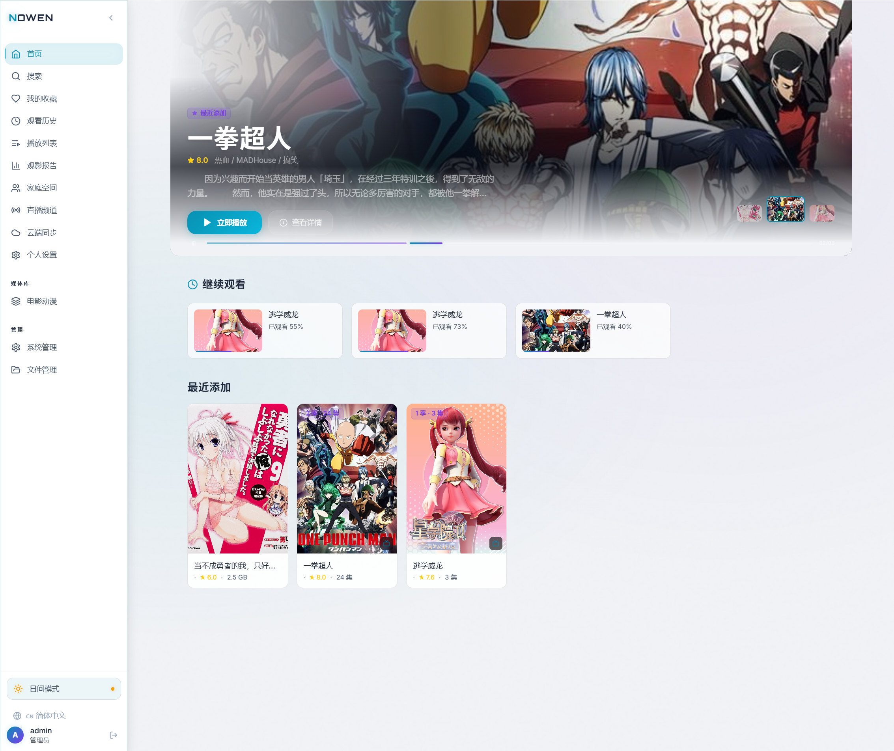
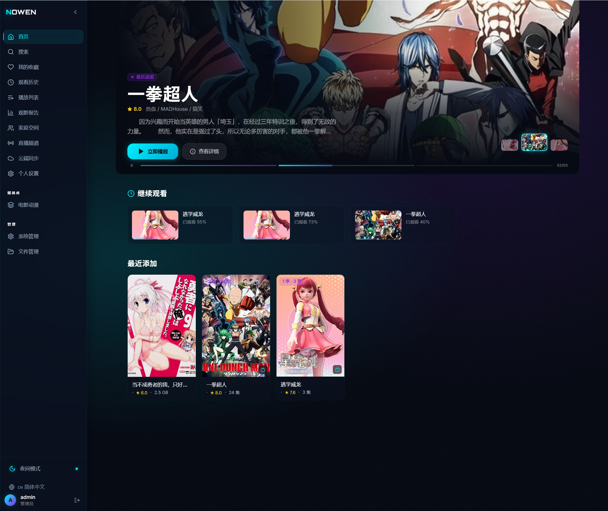

<div align="center">

<h1>🎬 nowen-video</h1>

<p><b>你的私人家庭影音中心 — 自托管、为 NAS 而生。</b></p>

<p>
  
  
  
  
  
  
</p>

<p>
  <a href="./README_EN.md">English</a> •
  <a href="#-快速开始">快速开始</a> •
  <a href="#-核心特性">特性</a> •
  <a href="#%EF%B8%8F-配置说明">配置</a> •
  <a href="./docs/SERVER.md">服务端架构</a> •
  <a href="./desktop/README.md">桌面客户端</a> •
  <a href="./android/README.md">Android</a>
</p>

</div>

---

基于 **Go + React** 构建的家庭媒体服务器，类似 Jellyfin / Emby，专为 NAS 与自托管部署优化。
**单二进制 + SQLite**，Docker 一键启动，零配置即可使用。

> **服务端版本说明**：Nowen Video 现在只有一个对外正式服务端。此前的 NAS 核心架构已经正式扶正，不再以 Lite 作为独立产品版本；旧完整服务只保留用于迁移、回滚和兼容验证。详见 [服务端架构说明](./docs/SERVER.md)。
>
> 🖥️ **PC 桌面客户端** 支持 MKV / HEVC / HDR / 杜比视界 / DTS / Atmos 等本地能力 → 详见 [desktop/README.md](./desktop/README.md)
>
> 📱 **Android** 使用 Kotlin + Jetpack Compose，具备服务器发现、扫码登录、媒体库、聚合搜索、剧集导航、原生播放和离线能力。仓库只保留这一套正式 Android 实现 → 详见 [android/README.md](./android/README.md)

## 📸 功能截图




## ✨ 核心特性

- 🎬 **媒体库** — 自动扫描 MKV / MP4 / AVI / MOV / WebM / TS / RMVB 等媒体，支持 FFprobe 元数据、外挂字幕、NFO 与文件监听
- 📺 **智能播放** — 服务端播放规划器统一决策直接播放、Remux 与按需 HLS 转码，并提供自动降级路径
- ⚡ **硬件加速** — 自动检测可用硬件能力，保留软件兜底；转码缓存、产物校验和恢复链路针对 NAS 长时间运行优化
- 🎨 **多源刮削** — TMDb、豆瓣、TheTVDB、Bangumi、Fanart.tv 等元数据源协同工作
- 📂 **剧集与合集** — 自动识别常见剧集命名，支持电影合集与剧集导航
- 🔤 **字幕** — 外挂字幕、内嵌字幕处理、在线字幕搜索，以及播放端字幕选择
- 👨‍👩‍👧‍👦 **多用户** — JWT 认证、独立观看历史/收藏/播放列表、媒体库权限与内容分级
- 🧠 **AI 可选能力** — 支持配置状态、实际运行状态与待重启状态分离；关闭时不会强行启动相关运行组件
- 🌐 **远程存储** — WebDAV / Alist / S3 按配置启用，不需要的能力不会作为常驻服务启动
- ✅ **统一任务中心** — 聚合媒体库扫描、刮削及转码维护任务，支持状态、进度、重试与生命周期事件
- 📱 **多端访问** — Web、桌面端与 Android 共用稳定的登录、媒体库、搜索、播放、收藏、历史和进度 API
- 🛡️ **安全** — JWT、bcrypt、CORS、安全响应头、限流和访问日志
- 🌍 **国际化** — 简体中文 / English / 日本語
- 🪶 **NAS 优先** — 单二进制 + SQLite (WAL)，Alpine Docker 镜像，健康检查，PUID/PGID 与持久化目录

> 历史版本中曾经存在的 Emby 兼容、音乐/图片库、投屏、插件、联邦、预处理等高级模块不再作为当前正式运行时的默认能力宣传。旧兼容运行时仅用于迁移、回滚与历史验证。

## 🚀 快速开始

### 一、Docker 部署（推荐）

```bash
git clone https://github.com/cropflre/nowen-video.git
cd nowen-video
docker-compose up -d
```

打开浏览器访问 `http://你的主机IP:8080`。

### 二、NAS 部署（群晖 / 威联通 / Unraid）

编辑 `docker-compose.yml`：

```yaml
services:
  nowen-video:
    image: nowen-video:latest
    container_name: nowen-video
    ports:
      - "8080:8080"
    environment:
      - PUID=1000
      - PGID=1000
      - NOWEN_SECRETS_JWT_SECRET=change-me-please
      - TZ=Asia/Shanghai
    volumes:
      - ./data:/data
      - ./cache:/cache
      - /volume1/Media:/media:ro
    devices:
      - /dev/dri:/dev/dri
    restart: unless-stopped
```

**容器参数说明：**

| 环境变量 / 参数 | 默认值 | 说明 |
|---|---|---|
| `PUID` / `PGID` | `1000` | 运行用户的 UID/GID（需匹配宿主机媒体目录权限） |
| `TZ` | `UTC` | 时区，国内建议 `Asia/Shanghai` |
| `NOWEN_APP_PORT` | `8080` | HTTP 端口 |
| `NOWEN_SECRETS_JWT_SECRET` | *(必填)* | JWT 签名密钥，首次部署务必修改 |
| `NOWEN_APP_DATA_DIR` | `/data` | 数据目录（数据库 + 上传文件） |
| `NOWEN_LOGGING_LEVEL` | `info` | `debug` / `info` / `warn` / `error` |
| `/dev/dri` 设备 | — | 可选，透传 Intel/AMD GPU 用于硬件加速 |

### 三、源码构建

环境要求：**Go、Node.js 20+、FFmpeg**

```bash
go mod tidy
cd web && npm install && cd ..

# 正式服务端开发模式
make dev

# 前端开发服务器（另开终端）
make dev-web

# 生产构建
make build
./bin/nowen-video
```

`make build`、`make dev`、默认 `Dockerfile` 都指向同一个 Nowen Video 正式服务端。

旧版兼容运行时只用于迁移/回滚验证，不应作为新的正式部署方式。详见 [docs/SERVER.md](./docs/SERVER.md)。

### 四、Android

正式 Android 客户端源码位于仓库根目录 `android/`，最低支持 Android 8.0 / API 26。旧 Android V1 与 `clients/android-v2` 已从当前代码树移除，不再维护 V1/V2 双轨和旧数据迁移逻辑。

- [Android README](./android/README.md)
- [Release Guide](./android/RELEASE.md)
- [Smoke Test](./android/SMOKE_TEST.md)

> Android 正式版从现在开始使用新的长期生产签名。此前已经安装旧 V1 且签名不同的设备需要先卸载旧应用再安装当前版本；后续版本将持续使用新的生产 keystore 正常覆盖升级。

## ⚙️ 配置说明

配置加载顺序（后者覆盖前者）：

```text
1. 内置默认值
2. config.yaml
3. config/*.yaml
4. NOWEN_* 环境变量
```

`config/` 目录下常用分片：

| 文件 | 用途 |
|---|---|
| `app.yaml` | 端口、调试、路径、FFmpeg 位置 |
| `database.yaml` | SQLite 路径、WAL、连接池 |
| `secrets.yaml` | JWT 密钥、第三方 API Key（切勿提交到 Git） |
| `logging.yaml` | 日志级别、格式、轮转 |
| `cache.yaml` | 转码缓存目录与清理策略 |
| `ai.yaml` | AI 提供商与模型配置 |

> 硬件加速、并发、转码执行与资源边界由服务端统一管理，避免 NAS 环境因为配置漂移进入不可恢复状态。

## 🏗️ 技术栈

**后端** Go · Gin · GORM + SQLite (WAL) · Zap · Viper · gorilla/websocket · fsnotify · FFmpeg

**Web 前端** React · TypeScript · Vite · Tailwind CSS · Zustand · HLS.js · React Router

**Android** Kotlin · Jetpack Compose · Media3 · Paging 3 · WorkManager · Hilt · Retrofit · Android Keystore

**部署** Docker (Alpine) · docker-compose

## 🗺️ 路线图

当前主线重点：

- ✅ NAS 核心服务端正式扶正为唯一正式版
- ✅ 服务端播放规划、自动回退与统一任务中心
- ✅ 持久转码执行状态、Lease、恢复与关闭协议
- ✅ Web 统一 Design System 与播放器体验收口
- ✅ Android 模块化客户端成为唯一正式实现
- 🧪 Android 新生产签名与正式发布验证
- 🚀 后续继续围绕播放稳定性、字幕、跨端体验与 NAS 资源效率演进

## 💬 交流与反馈

- **QQ 群**：`1093473044`
- **Issues**：欢迎在 GitHub 上提交问题与建议
- 提交问题时请勿公开 Token、密钥或私人服务器地址

## ☕ 赞赏支持

如果这个项目对你有帮助，欢迎请作者喝杯咖啡 / 买个键盘 / 修个 Bug 🙏

<p align="center">
  
  <br>
  <i>Drug 的赞赏码 — "支持作者买键盘 / 修 Bug"</i>
</p>

## 📜 开源协议

本项目采用 [GNU General Public License v3.0](./LICENSE)（GPL-3.0）开源协议发布。

你可以自由地运行、研究、修改和分发本软件。基于本项目的任何派生作品在对外分发时，必须同样以 GPL-3.0 协议开源，并保留原作者版权声明。本软件按“原样”提供，不附带任何明示或默示的担保。
