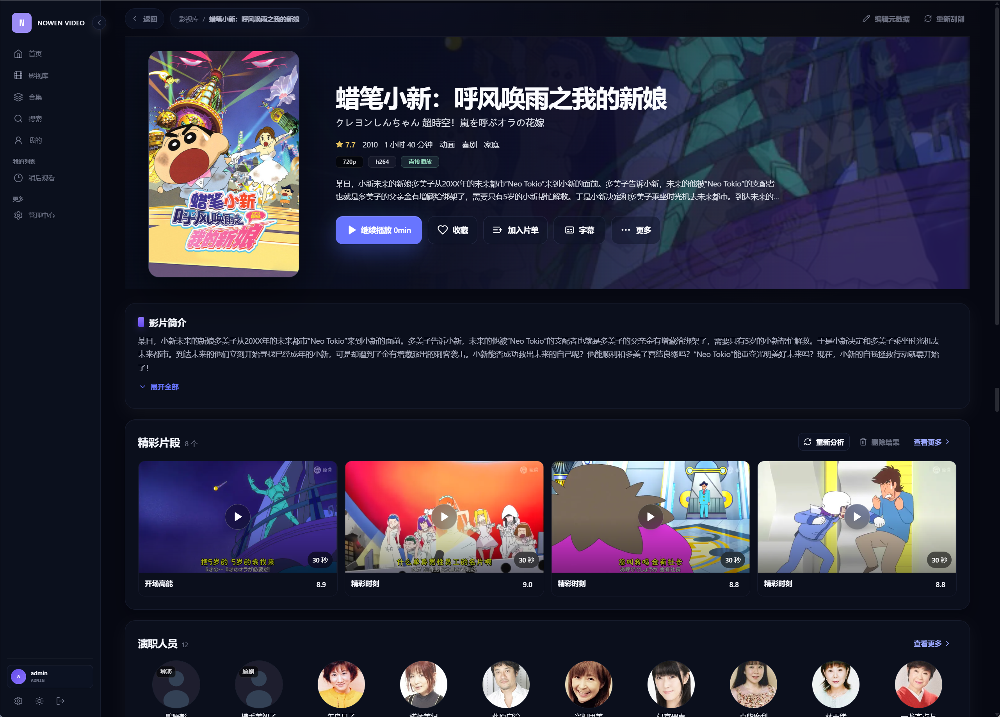
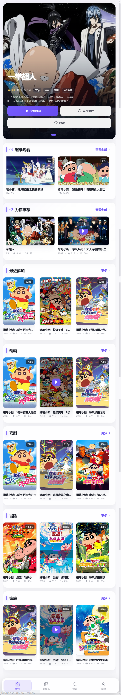
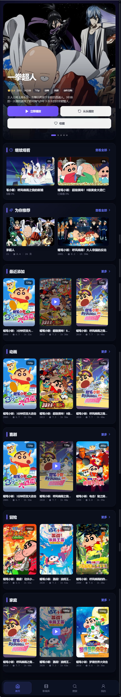
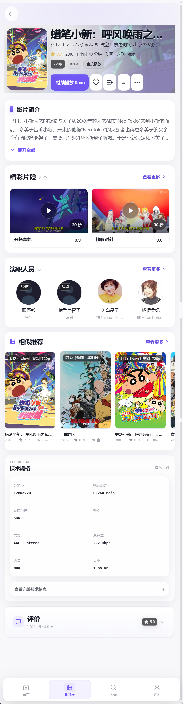
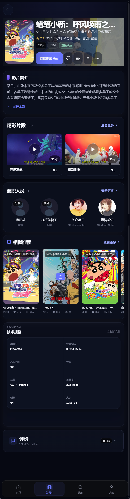
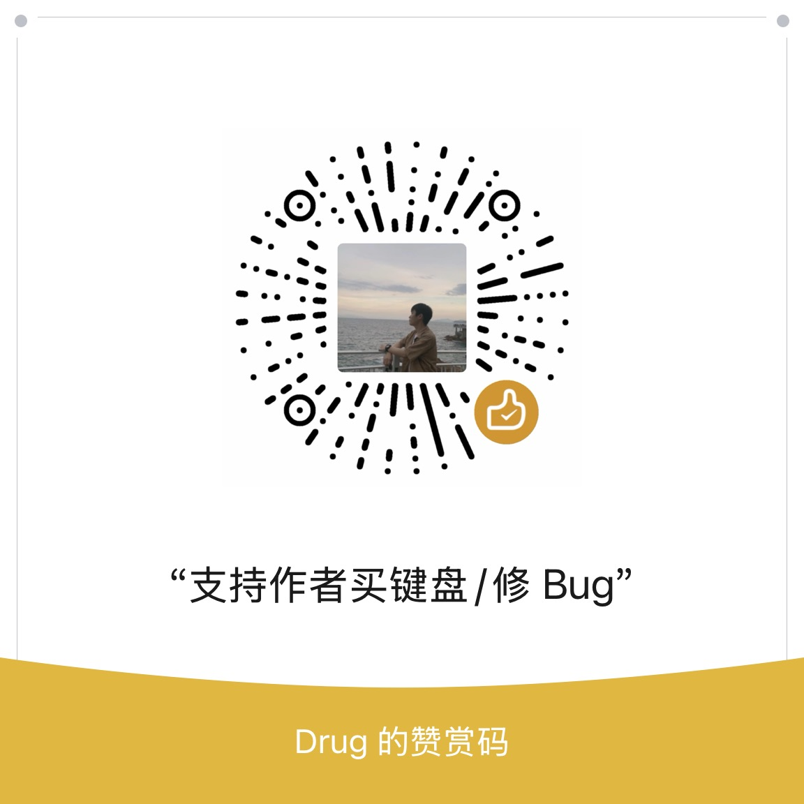

<div align="center">

<h1>🎬 Nowen Video</h1>

<p><b>为 NAS 与自托管场景打造的私人家庭影音平台。</b></p>

<p>
  
  
  
  
  
  
  
</p>

<p>
  <a href="./README_EN.md">English</a> •
  <a href="#-核心特性">核心特性</a> •
  <a href="#-快速开始">快速开始</a> •
  <a href="#-客户端与平台">客户端与平台</a> •
  <a href="#%EF%B8%8F-配置说明">配置</a> •
  <a href="./docs/SERVER.md">服务端架构</a> •
  <a href="./desktop/README.md">桌面端</a> •
  <a href="./android/README.md">Android</a>
</p>

</div>

---

Nowen Video 是基于 **Go + React + SQLite + FFmpeg** 构建的家庭媒体平台，面向 NAS、家庭服务器和自托管用户。

它提供从 **媒体扫描、元数据刮削、影视库管理、详情浏览、搜索、收藏与历史，到直接播放、Remux、按需 HLS 转码、字幕和多端访问** 的完整链路，并持续围绕长期稳定运行、低维护成本和跨端体验进行优化。

> **产品说明**：Nowen Video 当前只有一个对外正式服务端。历史上的 Lite / Full 产品区分已经退出正式产品体系；旧兼容运行时只保留用于迁移、回滚和历史验证。详见 [服务端架构说明](./docs/SERVER.md)。

## 📸 功能截图

当前界面覆盖桌面端与移动端，并提供日间与夜间模式。首页聚合 Hero 推荐、继续观看、为你推荐、最近添加和类型分区；影视库支持分类切换、筛选、排序、网格 / 列表视图与分页；详情页提供播放、收藏、加入片单、字幕、精彩片段、演职员、相似推荐、技术规格和评分等完整信息。

<table>
  <tr>
    <td width="50%"></td>
    <td width="50%"></td>
  </tr>
  <tr>
    <td align="center">桌面端 · 日间模式 · 首页</td>
    <td align="center">桌面端 · 夜间模式 · 首页</td>
  </tr>
  <tr>
    <td></td>
    <td></td>
  </tr>
  <tr>
    <td align="center">桌面端 · 日间模式 · 影视库</td>
    <td align="center">桌面端 · 夜间模式 · 影视库</td>
  </tr>
  <tr>
    <td></td>
    <td></td>
  </tr>
  <tr>
    <td align="center">桌面端 · 日间模式 · 详情页</td>
    <td align="center">桌面端 · 夜间模式 · 详情页</td>
  </tr>
  <tr>
    <td></td>
    <td></td>
  </tr>
  <tr>
    <td align="center">移动端 · 日间模式 · 首页</td>
    <td align="center">移动端 · 夜间模式 · 首页</td>
  </tr>
  <tr>
    <td></td>
    <td></td>
  </tr>
  <tr>
    <td align="center">移动端 · 日间模式 · 影视库</td>
    <td align="center">移动端 · 夜间模式 · 影视库</td>
  </tr>
  <tr>
    <td></td>
    <td></td>
  </tr>
  <tr>
    <td align="center">移动端 · 日间模式 · 详情页</td>
    <td align="center">移动端 · 夜间模式 · 详情页</td>
  </tr>
</table>

## ✨ 核心特性

### 🎬 媒体库与刮削

- 自动扫描 MKV / MP4 / AVI / MOV / WebM / TS / RMVB 等常见媒体文件
- 基于 FFprobe 获取媒体轨道、编码、时长等基础信息
- 支持 NFO、外挂字幕、文件监听和媒体资源刷新
- 支持 TMDb、豆瓣、TheTVDB、Bangumi、Fanart.tv 等元数据来源
- 自动识别常见电影、剧集与季集命名结构
- 支持电影合集、剧集导航和媒体详情工作区

### ▶️ 播放、Remux 与转码

- 服务端统一播放规划器，根据客户端和媒体能力选择 **直接播放 / Remux / 按需 HLS 转码**
- 播放失败时提供自动降级路径，减少手工切换
- Docker 正式镜像内置 FFmpeg 8.1.2
- 支持 Intel / AMD `/dev/dri` 硬件加速环境，并保留软件转码兜底
- 转码任务具备持久执行状态、缓存产物、校验、恢复与清理机制
- 播放器支持字幕、倍速、剧集切换等常用播放控制

### ✨ 本地媒体分析与精彩片段

- 支持本地媒体分析任务与实时进度事件
- 支持稀疏两阶段精彩片段分析，降低无意义的全量处理
- 支持精彩片段独立 Tab 与精彩片段播放模式
- 动态预览按需生成并可持久化，避免一次性生成大量无用资源
- 分析完成后可刷新详情页相关媒体素材

> 本地媒体分析属于持续演进中的能力，不要求所有媒体都预先完成分析后才能正常浏览或播放。

### 🎨 Aurora / Neo Glass 影视界面

- 首页、影视库、搜索、收藏、播放历史、详情页与播放器逐步统一到 Aurora 视觉体系
- 桌面端提供可折叠侧边栏，移动端提供底部主导航，并适配日间 / 夜间主题
- 首页提供 Hero 推荐轮播、继续观看、为你推荐、最近添加和按类型浏览等内容分区
- 影视库支持分类切换、筛选、排序、网格 / 列表视图与分页浏览
- 媒体详情页支持独立背景图、Hero 轮播、状态侧栏与真实 Tab 导航
- 详情页整合精彩片段、演职员、相似推荐、技术规格和评分区域
- 收藏、历史和继续观看使用统一媒体工作区
- 侧边栏支持折叠，播放器控制层采用统一玻璃拟态视觉
- 针对长标题、空状态、窄屏和高密度媒体库持续优化布局

### 🔤 字幕

- 外挂字幕扫描与播放选择
- 内嵌字幕轨道处理
- 在线字幕搜索
- Web / 桌面 / Android 播放端共享字幕相关接口能力

### 👨‍👩‍👧‍👦 用户与个人空间

- JWT 登录认证与 bcrypt 密码存储
- 首个注册用户自动成为管理员
- 独立收藏、观看历史、继续观看与播放进度
- 媒体库权限与内容分级能力
- 统一任务中心展示扫描、刮削和转码维护任务的状态、进度与生命周期

### 🌐 远程存储与可选能力

- WebDAV / Alist / S3 等远程存储能力按配置启用
- AI 相关能力按配置和实际运行状态启用，不作为默认常驻组件强制启动
- WebSocket 用于任务和媒体分析等实时进度事件

### 🛡️ NAS 与长期运行

- SQLite WAL 持久化
- Alpine Docker 正式镜像
- `/data` 与 `/cache` 独立持久化
- 支持 PUID / PGID 运行身份
- 容器健康检查
- 针对转码缓存、任务恢复、资源边界和长期运行场景进行专门治理

## 🚀 快速开始

### 一、Docker 部署（推荐）

直接使用 Docker Hub 正式镜像：

```bash
docker run -d \
  --name nowen-video \
  -p 8080:8080 \
  -e PUID=1000 \
  -e PGID=1000 \
  -e TZ=Asia/Shanghai \
  -v $(pwd)/data:/data \
  -v $(pwd)/cache:/cache \
  -v /path/to/media:/media:ro \
  --restart unless-stopped \
  cropflre/nowen-video:latest
```

如果需要 Intel / AMD 硬件加速，在 Linux / NAS 环境中额外透传 `/dev/dri`：

```bash
--device /dev/dri:/dev/dri
```

启动后访问：

```text
http://你的主机IP:8080
```

首次注册的用户会自动成为管理员。

### 二、Docker Compose

```yaml
services:
  nowen-video:
    image: cropflre/nowen-video:latest
    container_name: nowen-video
    ports:
      - "8080:8080"
    environment:
      - PUID=1000
      - PGID=1000
      - TZ=Asia/Shanghai
    volumes:
      - ./data:/data
      - ./cache:/cache
      - /volume1/Media:/media:ro
    devices:
      - /dev/dri:/dev/dri
    restart: unless-stopped
```

> 没有硬件加速需求时可删除 `devices` 段。

JWT Secret 未显式配置时，服务端会在首次启动时自动生成随机密钥并持久化到数据目录；如有统一密钥管理需求，也可以通过 `NOWEN_SECRETS_JWT_SECRET` 显式指定。

### 三、源码构建

环境要求：**Go 1.25、Node.js 20+、FFmpeg**

```bash
git clone https://github.com/cropflre/nowen-video.git
cd nowen-video

go mod download
cd web && npm ci && cd ..

# 正式服务端开发模式
make dev

# 前端开发服务器（另开终端）
make dev-web

# 生产构建
make build
./bin/nowen-video
```

`make build`、`make dev` 与默认 `Dockerfile` 都对应同一个 Nowen Video 正式服务端。

## 📱 客户端与平台

### Web

Web 是 Nowen Video 的主要管理与观影入口，提供媒体库、搜索、详情页、播放、收藏、历史、继续观看、任务状态与管理功能。

### 🖥️ Desktop

桌面客户端基于 **Tauri 2.0 + libmpv**，面向 Windows / macOS / Linux，并支持 Web `<video>` 与原生 mpv 双播放内核。

在本地播放环境下可覆盖 MKV、HEVC、AV1、HDR、杜比视界、DTS、TrueHD、Atmos 等 Web 浏览器不擅长的媒体场景。

详见 [desktop/README.md](./desktop/README.md)。

### 📱 Android

仓库根目录 `android/` 是唯一正式 Android 客户端：

- Kotlin + Jetpack Compose
- Media3
- Hilt
- Retrofit / OkHttp
- Paging 3
- WorkManager
- Android Keystore
- 最低 Android 8.0 / API 26
- targetSdk API 35
- applicationId：`com.nowen.video`

项目不再维护 V1 / V2 两套 Android 产品。

> 旧 V1 与当前正式版可能使用不同签名。已安装旧版且签名不一致的设备可能需要先卸载再安装；后续正式版本将持续使用当前生产签名进行覆盖升级。

详见 [android/README.md](./android/README.md)。

### 🐮 飞牛 fnOS

Nowen Video 已具备正式 fnOS `.fpk` 构建与发布链路，包括应用资源、Docker Project、桌面入口、安装 / 升级 / 卸载生命周期、权限声明与 fnpack 校验。

正式发布版本可从 GitHub Release 获取对应 `.fpk` 安装包。

## 📦 发布渠道

正式版本统一覆盖：

- **Docker Hub**：`cropflre/nowen-video:<version>` / `cropflre/nowen-video:latest`
- **Android**：APK / AAB
- **飞牛 fnOS**：`.fpk`
- **GitHub Release**：源码、版本说明及对应发布资产

发布流程会校验 Server CI、Release Contract、客户端正式候选构建、Docker 远端 manifest、Git Tag、GitHub Release 资产和渠道产物完整性。

## ⚙️ 配置说明

配置加载顺序（后者覆盖前者）：

```text
1. 内置默认值
2. config.yaml
3. config/*.yaml
4. NOWEN_* 环境变量
```

常用配置：

| 配置 | 默认值 | 说明 |
|---|---|---|
| `PUID` / `PGID` | 镜像内默认用户 | 容器运行 UID / GID |
| `TZ` | `Asia/Shanghai`（正式镜像） | 时区 |
| `NOWEN_APP_PORT` | `8080` | HTTP 服务端口 |
| `NOWEN_APP_DATA_DIR` | `/data` | 数据目录 |
| `NOWEN_DATABASE_DB_PATH` | `/data/nowen.db` | SQLite 数据库路径 |
| `NOWEN_CACHE_CACHE_DIR` | `/cache` | 转码与任务缓存目录 |
| `NOWEN_LOGGING_LEVEL` | `info` | `debug` / `info` / `warn` / `error` |
| `NOWEN_SECRETS_JWT_SECRET` | 自动生成 | 可选，自定义 JWT 签名密钥 |

`config/` 目录下常用分片：

| 文件 | 用途 |
|---|---|
| `app.yaml` | 端口、调试、路径、FFmpeg 位置 |
| `database.yaml` | SQLite 路径、WAL、连接池 |
| `secrets.yaml` | JWT 密钥、第三方 API Key |
| `logging.yaml` | 日志级别、格式、轮转 |
| `cache.yaml` | 转码缓存与清理策略 |
| `ai.yaml` | AI 提供商与模型配置 |

> 不要把真实 Token、API Key、JWT Secret 或私人服务器地址提交到 Git。

## 🏗️ 技术栈

**后端**：Go 1.25 · Gin · GORM · SQLite (WAL) · Zap · Viper · gorilla/websocket · fsnotify · FFmpeg 8.1.2

**Web**：React 18 · TypeScript · Vite · Tailwind CSS · Fluent UI · Framer Motion · Zustand · HLS.js · React Router

**Desktop**：Tauri 2.0 · Rust · WebView · mpv / libmpv

**Android**：Kotlin · Jetpack Compose · Media3 · Paging 3 · WorkManager · Hilt · Retrofit · Android Keystore

**部署**：Docker (Alpine) · Docker Compose · 飞牛 fnOS

## 🗺️ 当前演进方向

- ✅ 单一正式服务端产品身份
- ✅ 直接播放 / Remux / HLS 转码与自动回退
- ✅ 持久转码执行状态、Lease、恢复与产物治理
- ✅ Aurora / Neo Glass Web 视觉体系
- ✅ 本地媒体分析与精彩片段能力
- ✅ Android 模块化正式客户端
- ✅ Docker / Android / fnOS / GitHub Release 统一发布流程
- 🚀 持续优化播放稳定性、字幕体验、跨端一致性、媒体分析和 NAS 资源效率

## 💬 交流与反馈

- **QQ 群**：`1093473044`
- **GitHub Issues**：欢迎提交 Bug、功能建议与兼容性反馈
- 提交问题时请勿公开 Token、密钥或私人服务器地址

## ☕ 赞赏支持

如果这个项目对你有帮助，欢迎请作者喝杯咖啡 / 买个键盘 / 修个 Bug 🙏

<p align="center">
  
  <br>
  <i>Drug 的赞赏码 — “支持作者买键盘 / 修 Bug”</i>
</p>

也欢迎关注微信公众号「Nowen 开源实验室」，获取项目动态与开源实践分享。

<p align="center">
  
  <br>
  <i>微信公众号 · Nowen 开源实验室</i>
</p>

## 📜 开源协议

本项目采用 [GNU General Public License v3.0](./LICENSE)（GPL-3.0）开源协议发布。

你可以自由运行、研究、修改和分发本软件。基于本项目的派生作品在对外分发时必须遵守 GPL-3.0，并保留相应版权与许可证声明。本软件按“原样”提供，不附带任何明示或默示担保。
